# ACL Initial Lab

Material de **David Bombal**.

## Topología

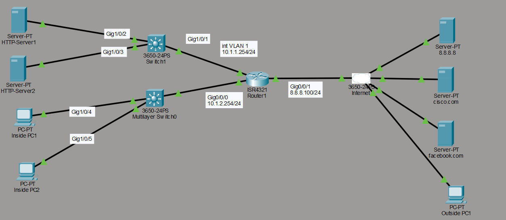

## Descripción del lab

Configurar ACLs de la siguiente manera:

**1) Restringir el tráfico interno usando Router1:**

- Usar el access list número 100.
- Inside PC1 solo puede acceder al HTTP Server 1 usando HTTP, dentro de la subnet 10.1.1.0/24.
- Inside PC2 solo puede acceder al HTTP Server 2 usando HTTPS, dentro de la subnet 10.1.1.0/24.
- Ningún otro PC o server de la subnet 10.1.2.0/24 puede acceder a la subnet 10.1.1.0/24 (esta línea debe añadirse de forma explícita; normalmente se usaría la palabra `log` para registrar el tráfico, pero Packet Tracer no soporta logging).
- Los hosts de la subnet 10.1.2.0/24 pueden acceder a cualquier otra network.
- La ACL debe aplicarse en el lugar más eficiente de Router1.

**2) Verificación:**

- Comprobar que Inside PC1 puede acceder al HTTP Server 1 interno usando HTTP, pero no puede hacer ping al HTTP Server 2.
- Comprobar que Inside PC2 puede acceder al HTTP Server 2 interno usando HTTPS, pero no puede hacer ping al HTTP Server 1.
- Comprobar que tanto Inside PC1 como Inside PC2 pueden navegar a cisco.com y facebook.com.

## Configuración aplicada

Este es el conjunto de comandos que apliqué en Router1 para cumplir con los requisitos del lab:

```cmd
Router1(config)#access-list 100 permit tcp host 10.1.2.101 host 10.1.1.100 eq 80
Router1(config)#access-list 100 permit tcp host 10.1.2.102 host 10.1.1.101 eq 443
Router1(config)#access-list 100 deny ip 10.1.2.0 0.0.0.255 10.1.1.0 0.0.0.255
Router1(config)#access-list 100 permit ip 10.1.2.0 0.0.0.255 any
!
Router1(config)#int g0/0/0
Router1(config-if)#ip access-group 100 in
```

Apliqué la ACL en la interfaz g0/0/0 de Router1, en dirección `in`, ya que es la interfaz conectada a la subnet 10.1.2.0/24 donde se originan los paquetes que quiero filtrar. De esta forma, el tráfico no deseado se descarta antes de entrar al router, lo cual es más eficiente que filtrarlo en la interfaz de salida.

A continuación muestro la salida del comando `show access-lists`, donde confirmo que las cuatro ACEs quedaron registradas en el orden correcto:

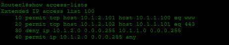

## Pruebas y verificación

### Inside PC1

Comprobé que Inside PC1 sí puede conectarse al HTTP Server 1 usando HTTP:

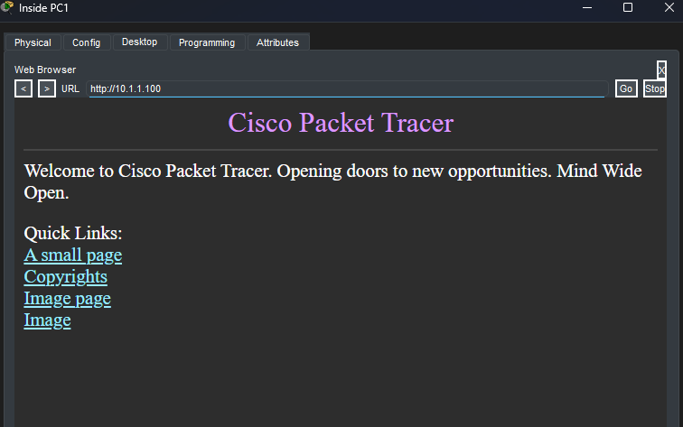

Sin embargo, al intentar acceder al mismo server usando HTTPS, la conexión no se completa, ya que esa ACE no está permitida (solo permití el puerto 80 para este host):

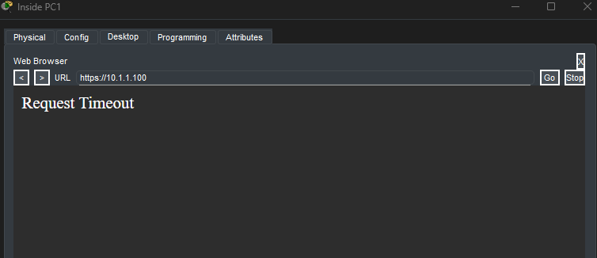

Tampoco puede acceder al HTTP Server 2, ya que Inside PC1 solo tiene permiso explícito hacia el HTTP Server 1:

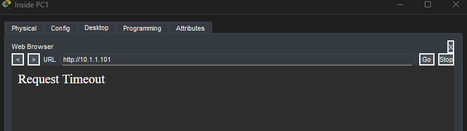

Al hacer ping desde Inside PC1 hacia ambos servers, obtengo "Destination host unreachable" en los dos casos. Esto ocurre porque la tercera ACE de la lista deniega todo el tráfico IP entre la subnet 10.1.2.0/24 y la subnet 10.1.1.0/24 que no haya sido permitido antes, y el protocolo ICMP no fue incluido en ninguna ACE de permit:

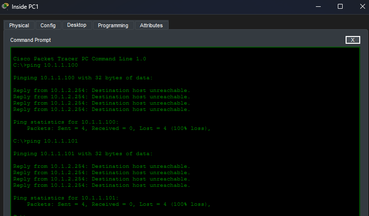

### Inside PC2

Con Inside PC2 hice la misma verificación. Comprobé que sí puede conectarse al HTTP Server 2 usando HTTPS:

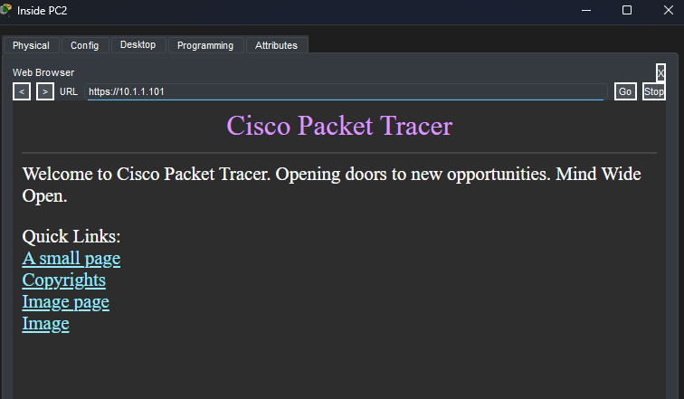

Al probar con HTTP hacia el mismo server, la conexión no se completa, ya que a este host solo le permití el puerto 443:

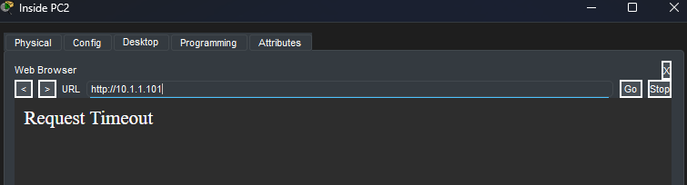

Tampoco puede acceder al HTTP Server 1, ya que Inside PC2 solo tiene permiso explícito hacia el HTTP Server 2:

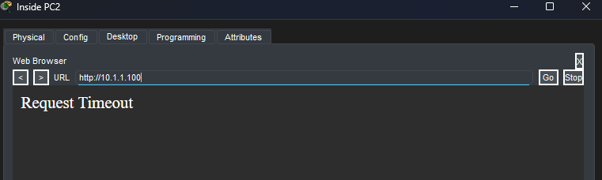

Ni siquiera usando HTTPS hacia el HTTP Server 1, dado que no existe ninguna ACE que permita ese tráfico:

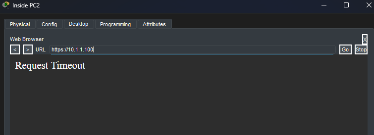

Al igual que con Inside PC1, el ping desde Inside PC2 hacia ambos servers falla, por el mismo motivo: la ACE de deny bloquea todo el tráfico IP restante entre las dos subnets:

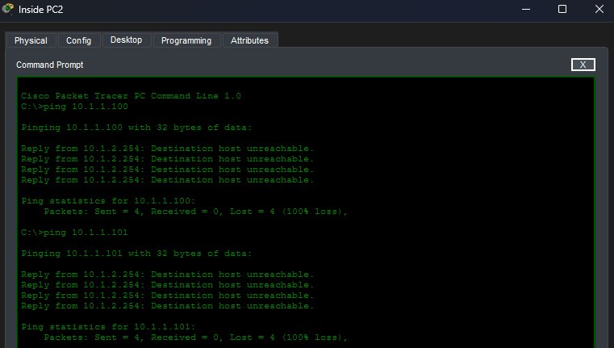

### Acceso a Internet

Por último, verifiqué que ambos PCs conservan el acceso a Internet, gracias a la última ACE de la lista, que permite todo el tráfico IP desde la subnet 10.1.2.0/24 hacia cualquier destino (`any`).

Desde Inside PC1 pude navegar sin problema a cisco.com:

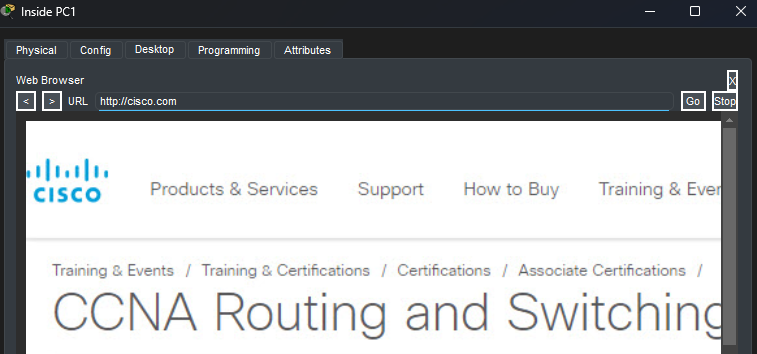

Y también a facebook.com:

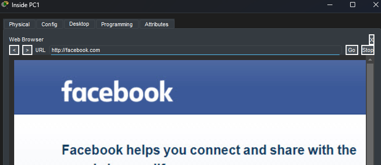

Desde Inside PC2 comprobé el acceso a un server externo (8.8.8.8):

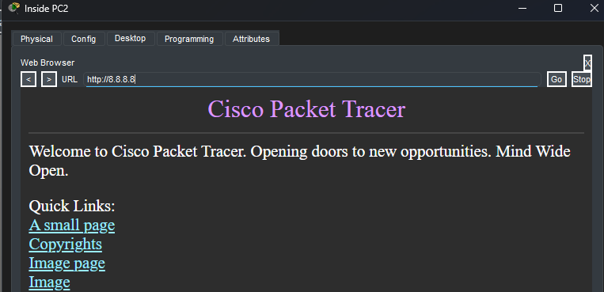

Y finalmente, a cisco.com:

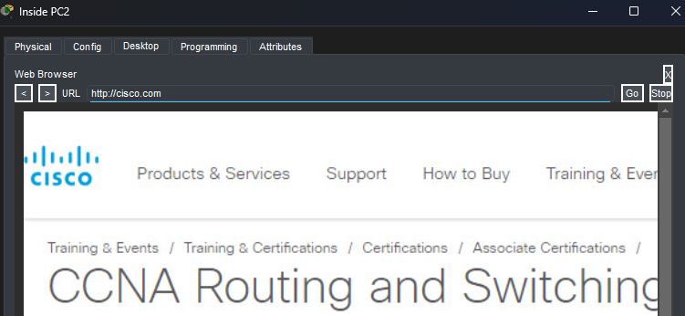
