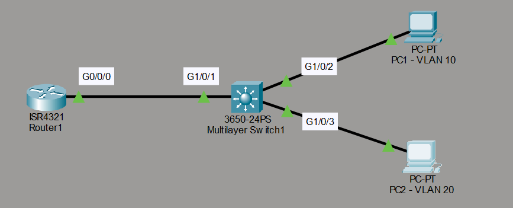
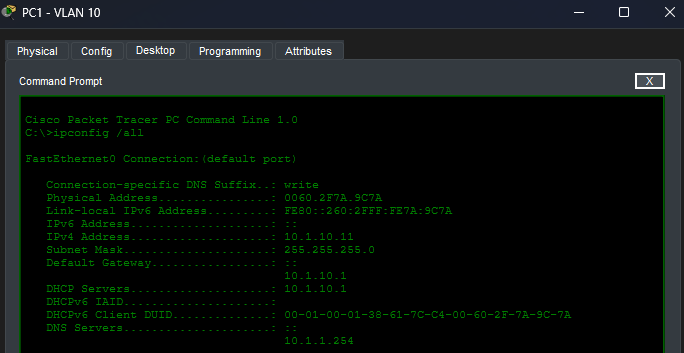
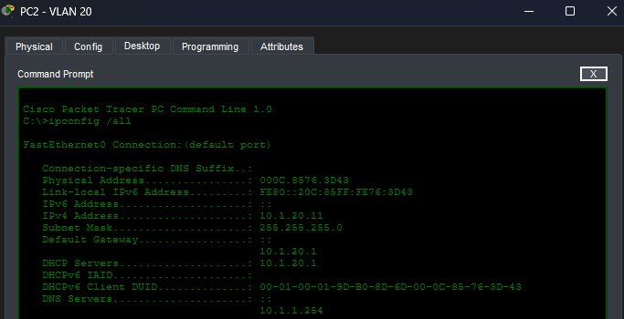
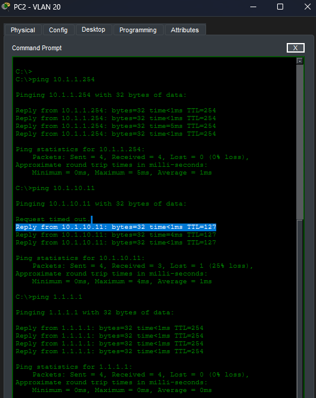

# DHCP Server Lab con VLANs

## Objetivo

Este laboratorio practica la configuración de un servidor DHCP en un switch de capa 3 para dar servicio a dos VLANs. El laboratorio fue realizado a partir del material de David Bombal.

## Topología



## Tareas del laboratorio

Configurar DHCP para las VLANs de la siguiente forma:

1. Excluir las primeras 10 direcciones IP de cada subred en su pool correspondiente. Los nombres de los pools son `vlan10` y `vlan20`.
2. Utilizar las redes `10.1.10.0/24` (VLAN 10) y `10.1.20.0/24` (VLAN 20).
3. Configurar como puerta de enlace predeterminada el Switch 1.
4. Configurar como servidor DNS el Router 1.
5. Comprobar que los equipos pueden hacer `ping` entre sí y a la loopback del Router 1.

## Configuración de los pools DHCP

```text
S1(config)# ip dhcp pool VLAN10
S1(dhcp-config)# network 10.1.10.0 255.255.255.0
S1(dhcp-config)# default-router 10.1.10.1
S1(config)# ip dhcp excluded-address 10.1.10.1 10.1.10.10
S1(dhcp-config)# dns-server 10.1.1.254
!
S1(config)# ip dhcp pool VLAN20
S1(dhcp-config)# network 10.1.20.0 255.255.255.0
S1(dhcp-config)# default-router 10.1.20.1
S1(config)# ip dhcp excluded-address 10.1.20.1 10.1.20.10
S1(dhcp-config)# dns-server 10.1.1.254
!
S1(config)# ip routing
```

Cada pool atiende a su propia subred: la puerta de enlace es la dirección del switch en esa VLAN y el servidor DNS es el Router 1 (`10.1.1.254`). El comando `ip routing` habilita el enrutamiento en el switch de capa 3, necesario para que las dos VLANs se comuniquen entre sí.

## Enlace entre el switch y el router

El enlace entre el switch de capa 3 y el Router 1 se configura como una interfaz enrutada:

```text
S1(config-vlan)# int vlan 1
S1(config-if)# no ip add
!
S1(config-if)# int g1/0/1
S1(config-if)# no switchport
S1(config-if)# ip add 10.1.1.252 255.255.255.0
S1(config-if)# no shut
!
S1(config)# router ospf 1
S1(config-router)# network 10.1.10.0 0.0.0.255 area 1
S1(config-router)# network 10.1.20.0 0.0.0.255 area 1
```

> **Nota:** Se configura OSPF entre el router y el switch de capa 3 para que ambos puedan compartir sus rutas.

En el Router 1 se anuncia la red loopback:

```text
R1(config)# router ospf 1
R1(config-router)# network 1.1.1.1 0.0.0.0 area 1
```

## Verificación de la asignación DHCP

Los equipos reciben su configuración mediante DHCP dentro de su correspondiente VLAN.





## Pruebas de conectividad

Las pruebas realizadas desde PC2 muestran la comunicación con el resto de dispositivos y con la loopback del Router 1.

