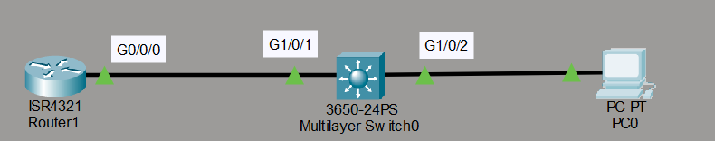
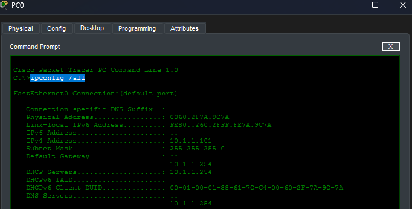
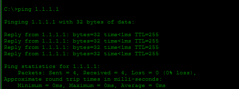

# DHCP Basic-Initial Lab

## Objetivo

Este laboratorio practica la configuración básica de un servidor DHCP en un router. El laboratorio fue realizado a partir del material de David Bombal.

## Topología



## Tareas del laboratorio

Configurar DHCP en el Router 1 de la siguiente forma:

1. Excluir el rango de direcciones `10.1.1.1` a `10.1.1.100`.
2. Crear un pool con el nombre `pc`.
3. Utilizar la red `10.1.1.0/24`.
4. Configurar como puerta de enlace predeterminada el Router 1.
5. Configurar como servidor DNS el Router 1.
6. Comprobar que el equipo puede hacer `ping` a la interfaz loopback del Router 1.

## Configuración del servidor DHCP

```text
R1(config)# ip dhcp excluded-address 10.1.1.1 10.1.1.100
R1(config)# ip dhcp pool PC
R1(dhcp-config)# network 10.1.1.0 255.255.255.0
R1(dhcp-config)# default-router 10.1.1.254
R1(dhcp-config)# dns-server 10.1.1.254
```

Con el comando `ip dhcp excluded-address` se reservan las primeras direcciones del rango, de modo que el servidor DHCP no las asigne a los equipos. El resto de configuración se define dentro del pool: la red utilizada, la puerta de enlace y el servidor DNS, que en ambos casos es el router con la dirección `10.1.1.254`.

## Verificación de la asignación

El equipo recibe su configuración mediante DHCP. Esta información puede comprobarse con el comando `ipconfig /all`.



## Prueba de conectividad

Se comprueba la conectividad realizando un `ping` a la dirección loopback del router, que es `1.1.1.1`. La prueba funciona correctamente.

