# Life of a Packet

## Objetivo

Este laboratorio analiza el recorrido de un paquete ICMP desde PC1 hasta PC2 y el recorrido de la respuesta en sentido contrario. Durante el proceso se observa el uso de ARP, la encapsulación de los paquetes y el comportamiento de un enlace serial entre dos routers.

El laboratorio fue realizado a partir del material de **David Bombal**.

## Topología

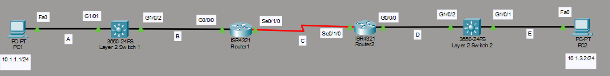

## Inicio de la comunicación

Para analizar la vida del paquete se envía un `ping` desde PC1 hacia PC2.

Antes de enviar el paquete ICMP, PC1 debe conocer la dirección MAC del siguiente dispositivo. Por este motivo, PC1 envía una solicitud ARP para descubrir la dirección MAC de la interfaz `G0/0/0` del router.

La solicitud ARP se envía como broadcast a la dirección MAC `FFFF.FFFF.FFFF`, ya que PC1 todavía no conoce la dirección MAC de destino.

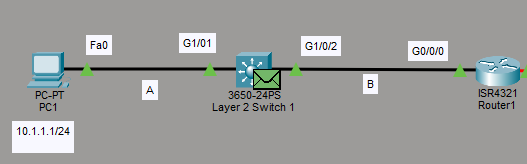

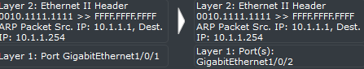

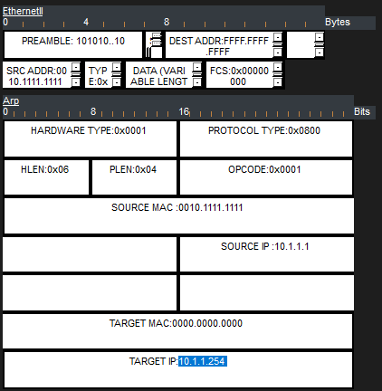

## Respuesta ARP y envío del paquete ICMP

Cuando la solicitud ARP llega a la interfaz del router, este responde con un mensaje **ARP Reply**. La respuesta incluye la dirección MAC de la interfaz solicitada.

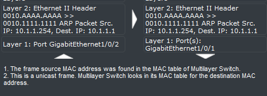

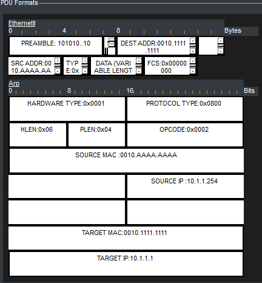

Una vez recibida la respuesta ARP, PC1 puede enviar el paquete ICMP. El paquete conserva como dirección IP de destino la dirección de PC2, pero utiliza como dirección MAC de destino la interfaz del primer router.

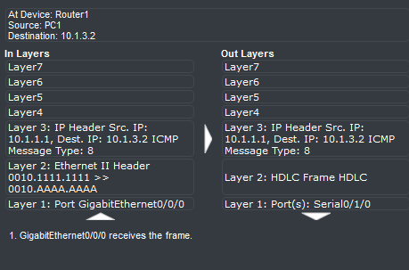

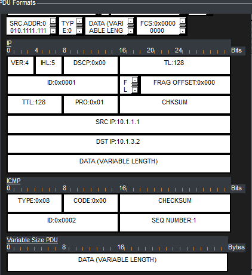

El paquete ARP se muestra con una encapsulación `PDU L2`, mientras que el paquete ICMP se analiza como una `PDU L3`.

## Enlace serial entre los routers

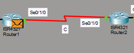

En este tramo existe un enlace serial punto a punto. Estos enlaces no utilizan direcciones MAC, por lo que los routers no necesitan intercambiar mensajes ARP entre sí.

ARP se utiliza en redes Ethernet para asociar una dirección IPv4 con una dirección MAC. Como el enlace serial no utiliza este tipo de direccionamiento, el paquete ICMP atraviesa el enlace sin una resolución ARP entre los routers.

La dirección IP de destino del paquete continúa siendo la dirección de PC2.

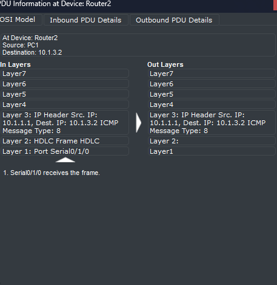

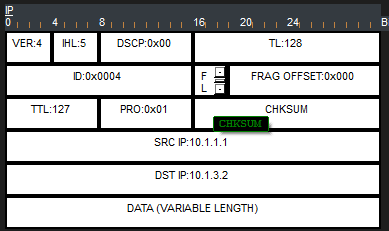

## Entrega del paquete a PC2

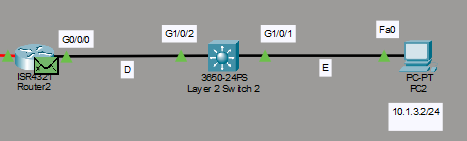

Cuando el router 2 recibe el paquete ICMP del router 1, necesita conocer la dirección MAC de PC2. Para obtenerla, envía una solicitud ARP a la dirección IPv4 de PC2.

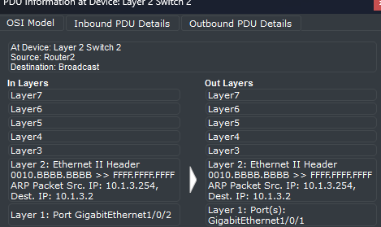

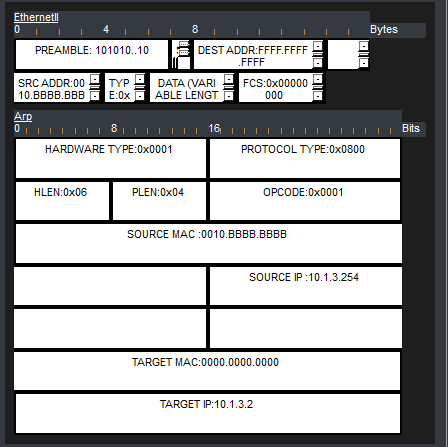

Después de completarse el proceso ARP entre el router 2 y PC2, el paquete ICMP llega a PC2. El equipo procesa la solicitud y prepara un mensaje **ICMP Echo Reply** para PC1.

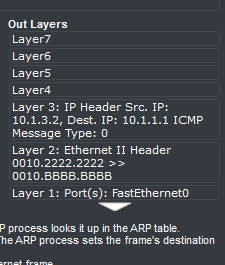

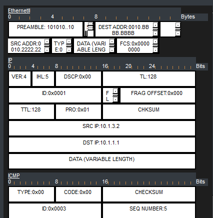

## Recorrido de la respuesta

Cuando PC2 envía el `ICMP Echo Reply`, la dirección MAC de destino corresponde a la interfaz del router 2.

El router 2 reenvía la respuesta al router 1 a través del enlace serial. En este enlace no es necesario cambiar una dirección MAC, porque los enlaces seriales punto a punto no utilizan direcciones MAC.

Al recibir la respuesta, el router 1 la envía hacia PC1. El paquete mantiene como dirección IP de origen la de PC2 y utiliza la dirección MAC de origen correspondiente a la interfaz del router 1 en la red Ethernet.

