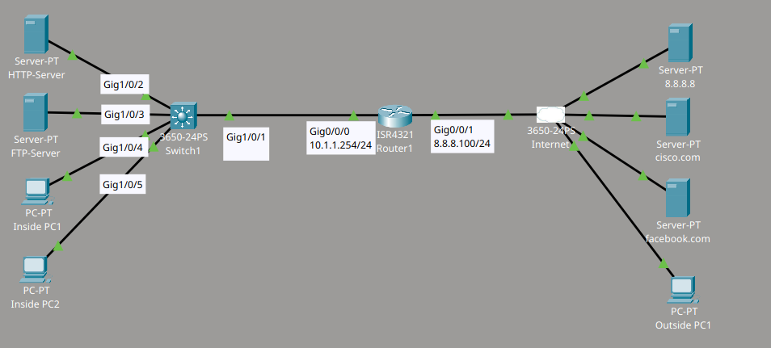
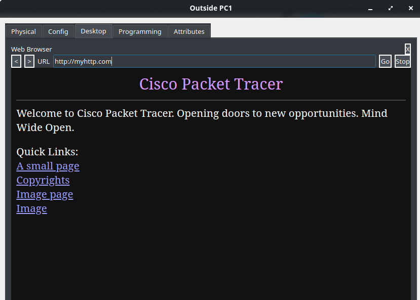
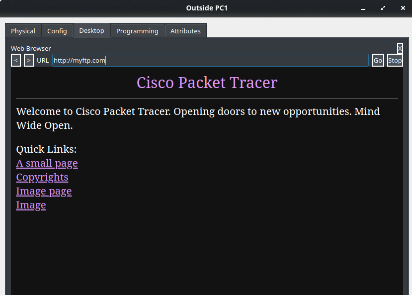
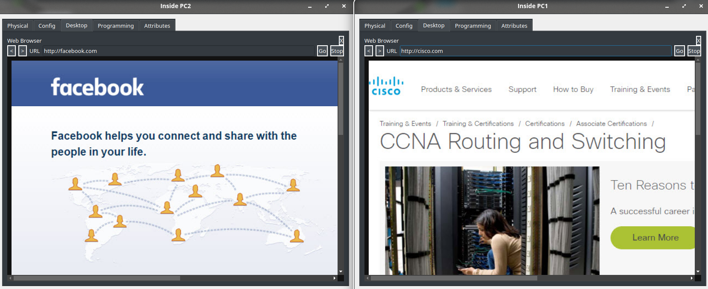
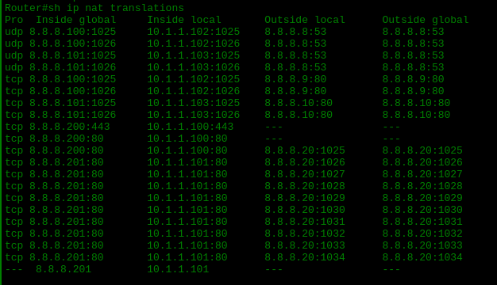

# Laboratorio NAT: Static NAT y Dynamic NAT

Material proporcionado por **David Bombal**.

## Descripción del laboratorio

Configure la red de la siguiente manera:

1. Router details:
   - Outside = 8.8.8.100/24
   - Inside = 10.1.1.254/24
   - Default Route hacia 8.8.8.8

2. Configure static NAT para que el PC externo pueda acceder a los servidores internos HTTP y FTP.
   - HTTP = 8.8.8.200 (traduzca únicamente el puerto necesario). DNS = myhttp.com
   - FTP = 8.8.8.201 (static NAT completo). DNS = myftp.com

3. Configure Dynamic NAT utilizando la dirección IP del router para que los PC internos puedan acceder a los servidores de Internet.

4. Verifique que el PC externo pueda acceder a los servidores internos utilizando sus nombres DNS.

5. Verifique que los PC internos puedan acceder a los servidores de Internet utilizando sus nombres DNS.

## Topología



## Configuración

A continuación explico cómo configuré el router para cumplir con los requisitos del laboratorio.

### Direccionamiento IP y Default Route

Primero configuré las interfaces del router. Asigné la dirección interna a la interfaz conectada al switch y la dirección externa a la interfaz conectada a Internet. Después agregué un Default Route para que el tráfico saliente tenga hacia dónde dirigirse.

```cmd
Router(config)#int g0/0/0
Router(config-if)#ip add 10.1.1.254 255.255.255.0
Router(config-if)#no shut
!
Router(config)#int g0/0/1
Router(config-if)#ip add 8.8.8.100 255.255.255.0
Router(config-if)#no shut
!
Router(config)#ip route 0.0.0.0 0.0.0.0 8.8.8.8
```

### Static NAT para los servidores internos

Para que el PC externo pudiera acceder a los servidores internos, definí primero cuáles interfaces son "inside" y cuáles son "outside". Luego apliqué dos tipos de static NAT:

- Para el servidor HTTP, tradujé únicamente los puertos necesarios (80 y 443), ya que solo necesito exponer el servicio web.
- Para el servidor FTP, apliqué static NAT completo, ya que este servicio requiere exponer todo el tráfico del servidor.

Finalmente, configuré el Dynamic NAT: creé una lista de acceso que identifica la red interna, definí un pool de direcciones públicas y asocié ambos elementos para que los PC internos puedan salir a Internet usando una dirección del pool.

```cmd
Router(config)#int g0/0/0
Router(config-if)#ip nat inside
!
Router(config-if)#int g0/0/1
Router(config-if)#ip nat outside
!
Router(config)#ip nat inside source static tcp 10.1.1.100 80 8.8.8.200 80
Router(config)#ip nat inside source static tcp 10.1.1.100 443 8.8.8.200 443
Router(config)#ip nat inside source static 10.1.1.101 8.8.8.201
!
Router(config)#access-list 1 permit 10.1.1.0 0.0.0.255
Router(config)#ip nat pool POOL1 8.8.8.100 8.8.8.105 netmask 255.255.255.0
Router(config)#ip nat inside source list 1 pool POOL1
```

## Pruebas realizadas

Para confirmar que la configuración funciona correctamente, hice pruebas desde el PC externo y desde los PC internos.

### Prueba desde el PC externo

Accedí al servidor HTTP interno utilizando su nombre de dominio (myhttp.com) y comprobé que la página cargó sin problema, lo que confirma que el static NAT de puertos funciona correctamente.



Después accedí al servidor FTP interno utilizando su nombre de dominio (myftp.com) y verifiqué que la conexión también funcionó correctamente.



### Prueba desde los PC internos

Desde los PC internos, comprobé el acceso a Internet accediendo a dos servidores externos mediante sus nombres de dominio (facebook.com y cisco.com). Ambas páginas cargaron correctamente, lo que confirma que el Dynamic NAT está funcionando.



### Verificación de las traducciones NAT

Por último, revisé la tabla de traducciones NAT del router con el comando `show ip nat translations`. En esta tabla puedo ver tanto las traducciones de Dynamic NAT (generadas por el pool NAT al navegar los PC internos) como las traducciones de static NAT configuradas para los servidores HTTP y FTP.

