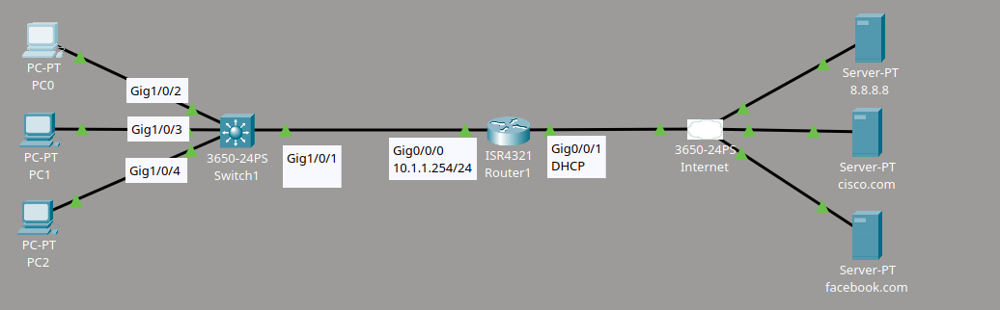
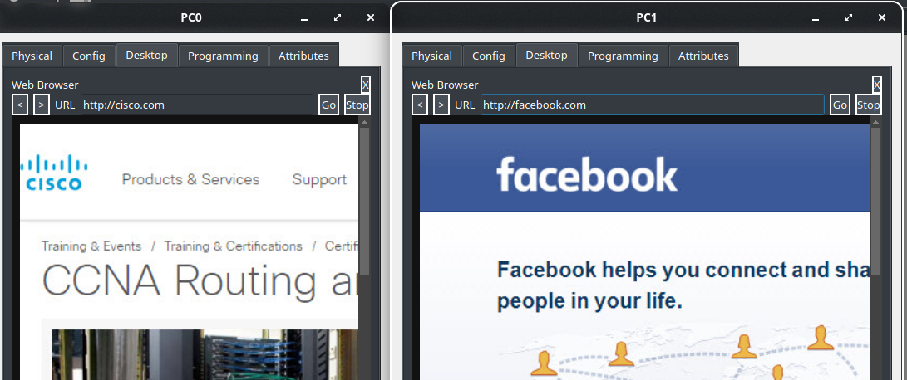
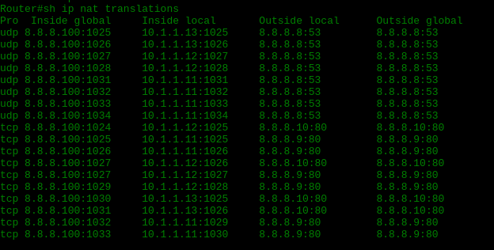

# Laboratorio NAT/PAT 1

## Topología



## Descripción del laboratorio

Material proporcionado por **David Bombal**.
Se debe configurar la red de la siguiente manera:

1. Configurar el router para que obtenga una dirección IP mediante DHCP desde el proveedor de internet (ISP).
2. Configurar el router para que asigne direcciones IP por DHCP a los clientes de la red interna:
   - Red = 10.1.1.0/24
   - Puerta de enlace predeterminada = 10.1.1.254
   - DNS = 8.8.8.8
3. Configurar el router para que los equipos internos puedan acceder a servidores de internet mediante PAT, usando la dirección IP del router.

## Configuración

Primero, configuro la interfaz que da salida a internet para que obtenga su dirección IP mediante DHCP:

```cmd
Router(config)#int g 0/0/1
Router(config-if)#ip address dhcp
Router(config-if)#no shut
```

A continuación, creo el pool de DHCP para asignar direcciones a los clientes internos:

```cmd
Router(config)#ip dhcp pool CLIENTS
Router(dhcp-config)#network 10.1.1.0 255.255.255.0
Router(dhcp-config)#default-rout
Router(dhcp-config)#default-router 10.1.1.254
Router(dhcp-config)#dns
Router(dhcp-config)#dns-server 8.8.8.8
Router(dhcp-config)#exit
Router(config)#ip dhcp excluded-address 10.1.1.1 10.1.1.10
```

Por último, defino las interfaces de entrada y salida para NAT, y configuro PAT (sobrecarga) usando la dirección IP de la interfaz de salida:

```cmd
Router(config)#int g0/0/0
Router(config-if)#ip nat inside
!
Router(config)#int g0/0/1
Router(config-if)#ip nat outside
!
Router(config)#access-list 1 permit 10.1.1.0 0.0.0.255
Router(config)#ip nat inside source list 1 interface g0/0/1 overload
```

## Pruebas

Verifico el funcionamiento de la configuración con las siguientes pruebas:





## Problemas encontrados

Encontré un inconveniente durante el lab. Al principio, únicamente conseguía configurar la NAT utilizando un NAT pool; no lograba hacerlo con la interfaz de salida del router. Después de configurar el NAT pool sin éxito, volví a probar la configuración anterior, que solo funcionaba con la interfaz, y eliminé por completo la configuración del NAT pool. A partir de ese momento, la configuración funcionó correctamente. Considero que se trató de un problema del propio Packet Tracer.
