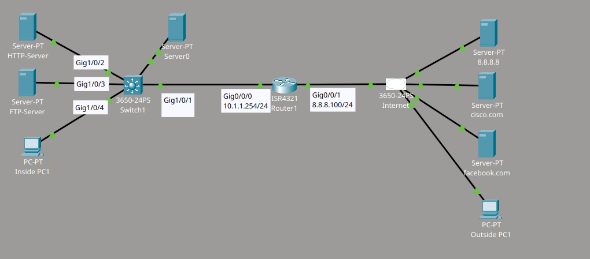
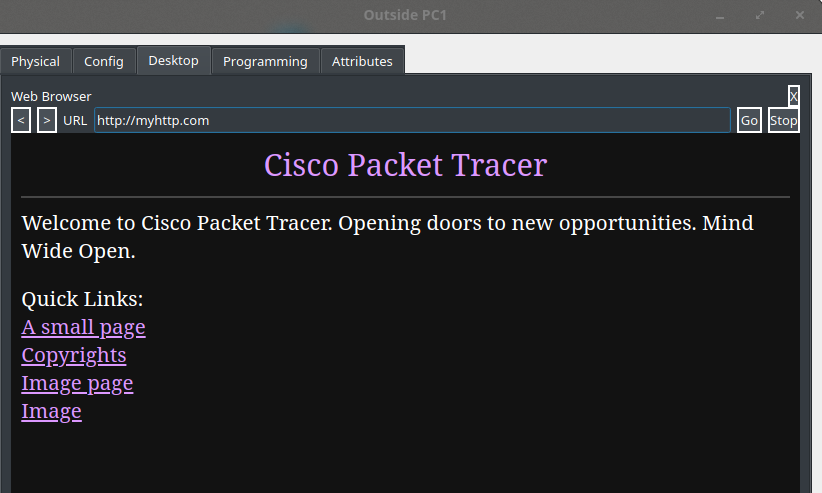
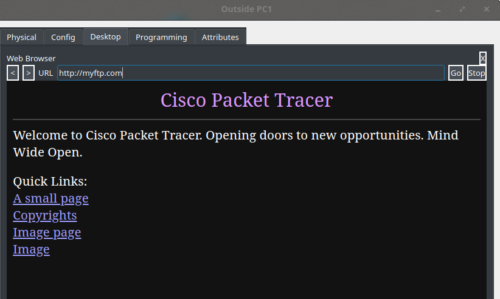
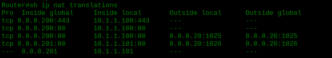
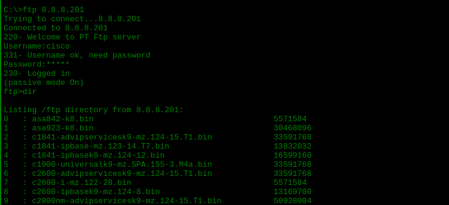
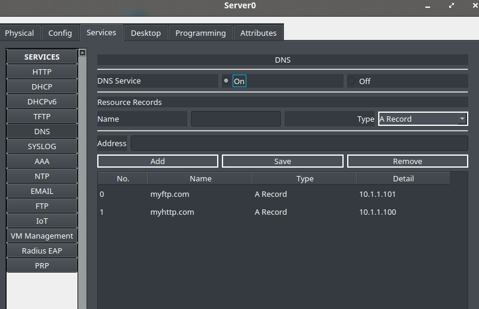
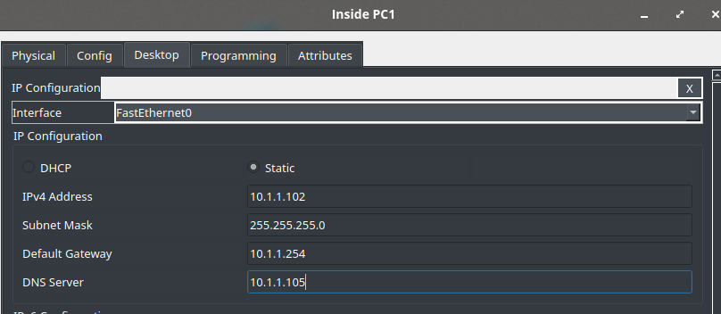

# Static NAT Lab

## Descripción del laboratorio

Material proporcionado por **David Bombal**

Este laboratorio tiene como objetivo configurar NAT estática en un router Cisco para permitir que un equipo externo acceda a servidores internos (HTTP y FTP) mediante direcciones IP públicas.

Se debe configurar la red de la siguiente manera:

1. **Datos del router:**
   - Interfaz externa (outside): 8.8.8.100/24
   - Interfaz interna (inside): 10.1.1.254/24
   - Ruta por defecto hacia 8.8.8.8

2. **Configurar NAT estática** para que el PC externo pueda acceder a los servidores internos HTTP y FTP:
   - HTTP = 8.8.8.200 (NAT únicamente del puerto requerido). DNS = myhttp.com
   - FTP = 8.8.8.201 (NAT estática completa). DNS = myftp.com

3. **Verificar** que tanto el equipo interno como el externo puedan acceder a los servidores internos:
   - El equipo interno debe usar las direcciones IP internas.
   - El equipo externo debe usar los nombres DNS.

## Topología



### Configuración de las interfaces del router

Primero configuro las direcciones IP en las dos interfaces del router: la interfaz interna, conectada a la red local, y la interfaz externa, conectada a Internet.

```cmd
Router(config)#int g0/0/1
Router(config-if)#ip add 8.8.8.100 255.255.255.0
Router(config-if)#no shut
!
Router(config-if)#int g0/0/0
Router(config-if)#ip add 10.1.1.254 255.255.255.0
Router(config-if)#no shut
```

### Configuración de NAT estática

Después indico al router cuál interfaz es interna y cuál es externa para NAT, y creo las traducciones estáticas necesarias:

- Para el servidor HTTP (10.1.1.100), solo traduzco los puertos 80 y 443, ya que únicamente necesito exponer el servicio web.
- Para el servidor FTP (10.1.1.101), realizo una traducción estática completa, de modo que toda la dirección quede expuesta.

```cmd
Router(config-if)#int g0/0/0
Router(config-if)#ip nat inside
!
Router(config-if)#int g0/0/1
Router(config-if)#ip nat outside
!
Router(config)#ip nat inside source static tcp 10.1.1.100 80 8.8.8.200 80
Router(config)#ip nat inside source static tcp 10.1.1.100 443 8.8.8.200 443
Router(config)#ip nat inside source static 10.1.1.101 8.8.8.201
```

### Verificación desde el equipo externo

Desde el PC externo, compruebo que puedo acceder al servidor HTTP interno usando el nombre de dominio `myhttp.com`, que se resuelve a la dirección pública 8.8.8.200.



De la misma manera, verifico el acceso al servidor FTP interno usando el nombre de dominio `myftp.com`, que se resuelve a la dirección pública 8.8.8.201.



Con el comando `show ip nat translations`, reviso en el router las traducciones activas. Puedo observar cómo las direcciones internas 10.1.1.100 y 10.1.1.101 quedan asociadas a las direcciones públicas 8.8.8.200 y 8.8.8.201.



### Verificación desde el equipo interno

También compruebo el acceso al servidor FTP directamente desde un cliente interno, usando la línea de comandos y la dirección IP interna del servidor.



### Configuración del DNS interno

Para que el equipo externo pueda resolver los nombres `myhttp.com` y `myftp.com`, configuro un servidor DNS interno con la dirección 10.1.1.105 y añado los registros correspondientes.



Finalmente, en el equipo interno, configuro el servidor DNS interno como servidor DNS preferido, de forma que se use antes que cualquier servidor externo.

