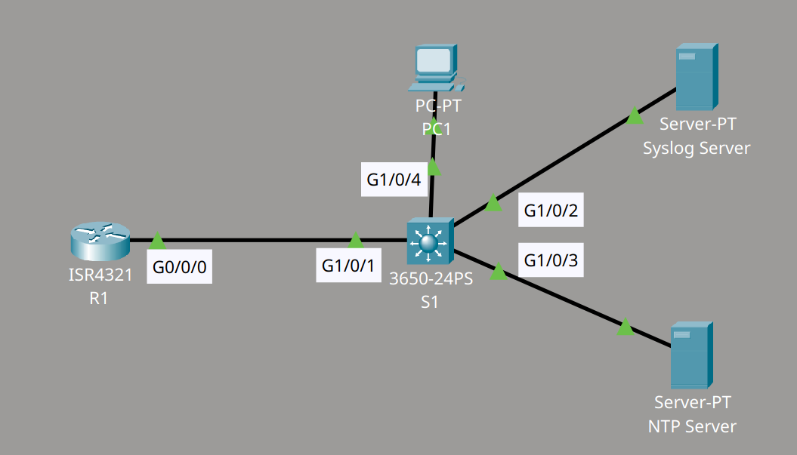
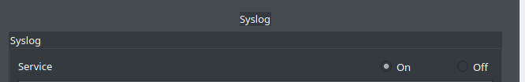
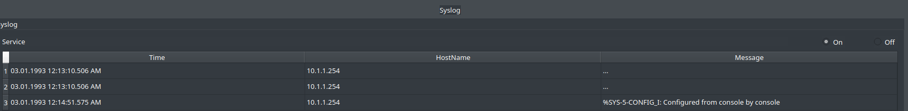
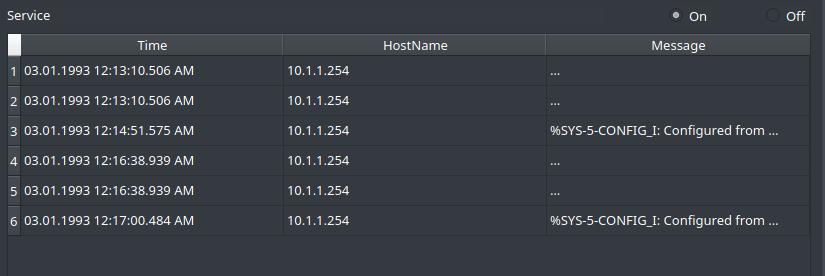
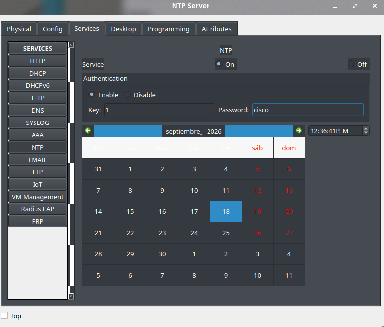

# NTP & Syslog - Basic Lab

## Descripción del laboratorio

En este laboratorio se configuran los servicios de Syslog y NTP en una topología compuesta por un router (R1), un switch (S1), un Syslog server y un NTP server.

Material proporcionado por **David Bombal**.

Objetivos:

**Syslog**

1. Configurar el Syslog server.
2. Configurar R1 y S1 para que envíen sus mensajes de log al Syslog server.
3. Crear una interfaz loopback en R1 y verificar que los mensajes de Syslog se muestran correctamente.
4. Apagar la interfaz loopback y verificar los mensajes de Syslog. A continuación, volver a activarla.
5. Apagar y luego activar (shut / no shut) la interfaz del switch conectada al PC, y verificar que los mensajes de Syslog se muestran.

**NTP**

6. Configurar el NTP server.
7. Comprobar la hora en R1 y S1.
8. Configurar R1 y S1 para que envíen timestamps al Syslog server.
9. Configurar R1 y S1 para que obtengan la hora del NTP server.
10. Verificar que los relojes quedan sincronizados correctamente.
11. Apagar y activar la interfaz loopback en R1, y verificar que los mensajes de Syslog muestran la hora correcta.
12. Apagar la interfaz del switch conectada al PC y verificar que los mensajes de Syslog se muestran con la hora correcta.

## Topología




## Configuración del Syslog server

Este primer paso no presenta mayor complicación. Activo el Syslog server pulsando el botón "On".



A continuación, configuro el Syslog server en el router y activo el servicio de timestamps para que se muestre la fecha y la hora en las que ocurre cada evento. Añado el parámetro `msec` al final porque Packet Tracer lo exige como parte del comando. También sería posible utilizar el comando `service sequence-number`, pero Packet Tracer no lo reconoce.

```cmd
R1(config)#logging host 10.1.1.200
R1(config)#logging trap debugging
R1(config)#service timestamps log datetime msec
!
S1(config)#logging host 10.1.1.200
S1(config)#logging trap debugging
S1(config)#service timestamps log datetime msec
```

### Verificación con la interfaz loopback

Configuro una interfaz loopback en el router y compruebo que el log correspondiente aparece en el Syslog server.

```cmd
R1(config)#int l0
R1(config-if)#ip address 1.1.1.1 255.255.255.255
R1(config-if)#no shut
```



Apago la interfaz loopback y compruebo que el Syslog server también recibe el mensaje correspondiente a este cambio de estado.

```cmd
R1(config)#int l0
R1(config-if)#shut
```




### Verificación con la interfaz del switch

Apago y vuelvo a activar el enlace entre el switch y el PC, es decir, reinicio la interfaz. Compruebo que esta información llega al Syslog server y queda registrada.

```cmd
S1(config)#int g1/0/4
S1(config-if)#shut
S1(config-if)#no shut
```


## Configuración del NTP server

Paso a la parte de NTP. Además de activar el NTP server, decido activar también la autenticación, ya que considero que es una buena práctica activarla de forma general.



Antes de aplicar los cambios, compruebo la hora en R1 y en S1:

```cmd
R1#sh clock
*0:27:47.410 UTC Mon Mar 1 1993
-
R1#show clock detail
*0:28:59.772 UTC Mon Mar 1 1993
Time source is hardware calendar
!
S1#sh clock
*0:27:43.678 UTC Mon Mar 1 1993
-
S1#show clock detail
*0:29:6.907 UTC Mon Mar 1 1993
Time source is hardware calendar
```

Configuro la autenticación y el cliente NTP en R1 y en S1:

```cmd
R1(config)#ntp authenticate
R1(config)#ntp authentication-key 1 md5 cisco
R1(config)#ntp trusted-key 1
R1(config)#ntp server 10.1.1.201 key 1
!
S1(config)#ntp authenticate
S1(config)#ntp authentication-key 1 md5 cisco
S1(config)#ntp trusted-key 1
S1(config)#ntp server 10.1.1.201 key 1
```

Después de guardar los cambios y reiniciar el router y el switch, compruebo que tanto el calendar como el reloj de software quedan sincronizados con el NTP server.


### Verificación final con la hora sincronizada

Activo y desactivo la interfaz loopback en el router, y compruebo que el Syslog server muestra la hora sincronizada con el NTP server, es decir, la misma hora que utiliza el router.

```cmd
R1(config)#int l0
R1(config-if)#no shut
R1(config-if)#shut
```


Compruebo también que, al repetir el cambio de estado en la interfaz del switch, el log queda registrado con la hora correcta.

```cmd
S1(config)#int g1/0/4
S1(config-if)#shut
S1(config-if)#no shut
```


