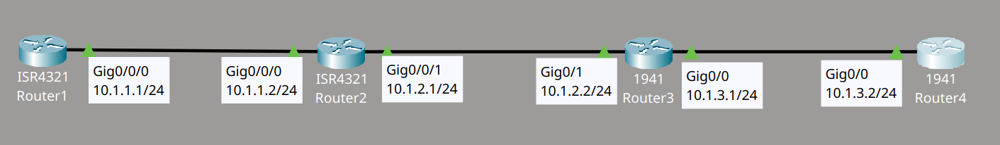
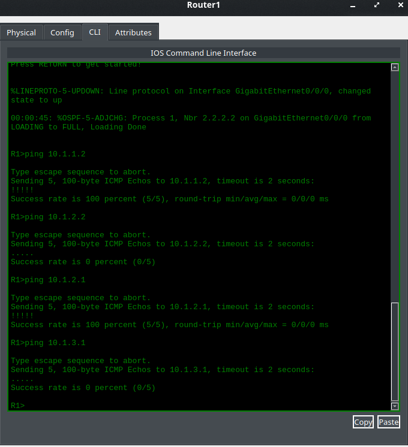
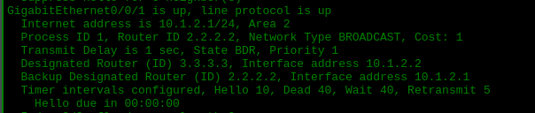
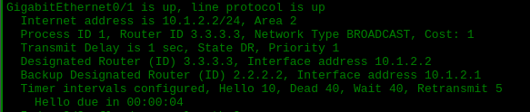
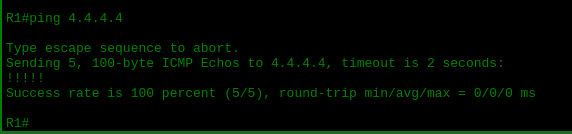

# OSPF Troubleshooting - Lab 1

## Descripción del lab

Un cliente reporta que Router1 no puede hacer ping a la loopback de Router4. El objetivo del lab es diagnosticar la red y corregir el fallo hasta restablecer la conectividad completa entre ambos extremos.

Material proporcionado por **David Bombal**.

## Topología



## Metodología de troubleshooting

Para diagnosticar el problema, seguí esta guía de verificación, un checklist estándar para descartar las causas más comunes de fallos en OSPF:

1. El número de area debe coincidir.
2. Las interfaces deben estar en la misma subred.
3. El proceso OSPF no debe estar apagado (shutdown).
4. Los router ID de OSPF deben ser únicos.
5. Los timers de Hello y Dead deben coincidir.
6. La configuración de authentication debe coincidir.
7. La configuración de IP MTU debe coincidir.
8. El network type de OSPF debe coincidir.

## Diagnóstico

Empecé comprobando la conectividad desde Router1 hacia el resto de la red. El ping al vecino directo (10.1.1.2) funcionó sin problemas, pero los pings a 10.1.2.2 y a 10.1.3.1 fallaron. Esto indicaba que la adyacencia OSPF entre Router2 y Router3 no se estaba formando correctamente.



## Causa raíz

Revisé la configuración de todos los routers y encontré un **area mismatch** en el enlace entre Router2 y Router3. En la interfaz Gig0/0/1 de Router2, el area configurada era la 0, mientras que en el otro extremo del enlace la interfaz pertenecía al area 2. Esta diferencia impedía que se formara la adyacencia OSPF entre ambos vecinos.




## Solución

Corregí el area en la interfaz Gig0/0/1 de Router2 para que coincidiera con la del vecino:

```cmd
R2(config)#int g0/0/1
R2(config-if)#no ip ospf 1 area 0
R2(config-if)#ip ospf 1 area 2
```

## Verificación

Tras aplicar el cambio, la adyacencia OSPF se formó correctamente y comprobé la conectividad extremo a extremo con un ping desde Router1 hacia la loopback de Router4 (4.4.4.4), que resultó exitoso.


