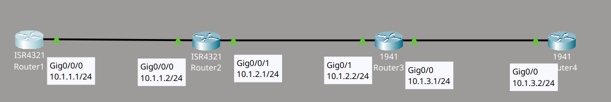
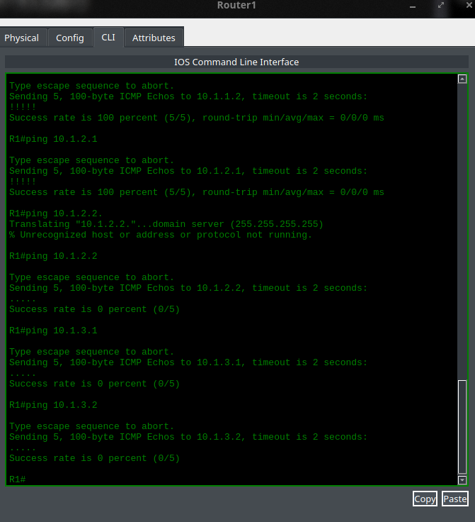
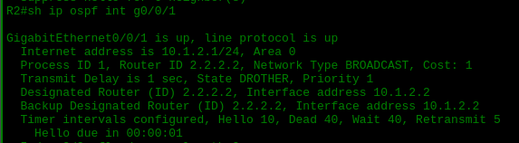
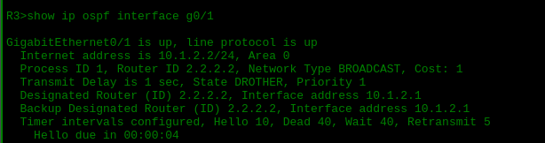
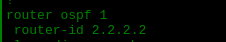
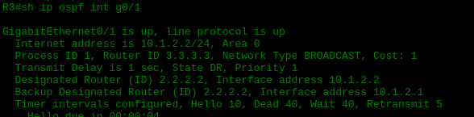
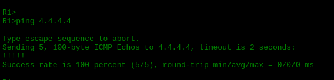

# OSPF Troubleshooting Lab 2

## Descripción del lab

Material proporcionado por **David Bombal**.

Este lab consiste en una topología de cuatro routers Cisco (Router1, Router2, Router3 y Router4) conectados en serie mediante interfaces Gigabit Ethernet, todos dentro del Area 0 de OSPF. El objetivo es identificar y corregir un problema de adyacencia OSPF que impide la comunicación entre extremos de la red.



## El problema

Al hacer ping desde Router1 hacia el resto de los routers, comprobé que solo llegaban las respuestas de las direcciones más cercanas. Las direcciones del Router3 y del Router4 no respondían.



Revisé el estado de OSPF en cada interface y encontré la causa: el Router2 y el Router3 tenían el mismo router ID (2.2.2.2) en el enlace que los conecta. Al coincidir el router ID, OSPF no podía formar la vecindad correctamente entre ambos.




## Diagnóstico y solución

Primero intenté eliminar el router ID configurado manualmente en el Router3, con la intención de que OSPF tomara automáticamente la dirección de la interface loopback como nuevo router ID:

```cmd
R3(config)#router ospf 1
R3(config-router)#no router-id 2.2.2.2
R3#clear ip ospf process
Reset ALL OSPF processes? [no]: yes
```



Sin embargo, el router ID no se reinició. Por esta razón, opté por asignar el router ID de forma manual:

```cmd
R3(config)#router ospf 1
R3(config-router)#router-id 3.3.3.3
```

Después de este cambio, detecté un segundo problema: el Router4 seguía reconociendo el router ID antiguo (2.2.2.2) del Router3, ya que este último actuaba como Designated Router (DR) del segmento. Como consecuencia, el Router4 no lograba identificar correctamente al Router3 y los pings entre Router1 y Router4 seguían fallando.


Para resolver esto, ejecuté el siguiente comando en el Router4 con el fin de reiniciar el proceso de OSPF:

```cmd
R4#clear ip ospf process
```

## Verificación

Tras reiniciar el proceso de OSPF en el Router4, repetí la prueba de conectividad desde Router1 hacia el Router4 y esta vez el ping fue exitoso:


