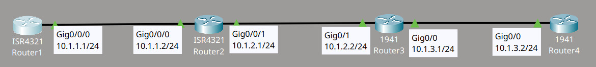
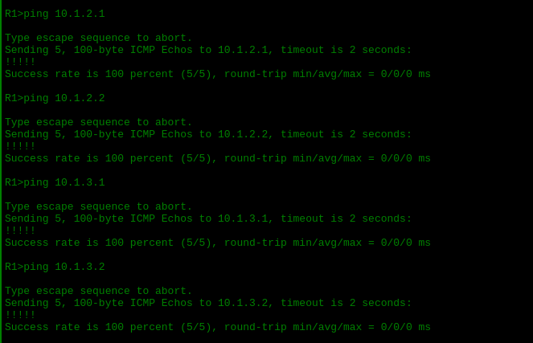

# OSPF Single Area

## Descripción del lab

Material proporcionado por **David Bombal**.

La topología está formada por cuatro routers conectados en línea (R1, R2, R3 y R4). El objetivo es configurar OSPF en una única area, utilizando en cada router un método distinto de habilitación del protocolo:

1. Utilizar el process ID 1 de OSPF en todos los routers.
2. En R1, habilitar OSPF mediante el network command con la IP exacta de la interfaz.
3. En R2, habilitar OSPF mediante el network command utilizando la subnet mask de la red.
4. En R3, habilitar OSPF mediante el interface command.
5. En R4, habilitar OSPF en todas las interfaces con un único network command.

## Topología



## Configuración


```cmd
R1(config)#router ospf 1
R1(config-router)#network 10.1.1.0 0.0.0.255 area 0
!
R3(config)#int g0/1
R3(config-if)#ip ospf 1 area 0
!
R3(config)#int g0/0
R3(config-if)#ip ospf 1 area 0
!
R4(config)#router ospf 1
R4(config-router)#network 0.0.0.0 255.255.255.255 area 0
```

## Verificación

Una vez aplicada la configuración en los cuatro routers, hago una pequeña comprobación desde R1. Realizo ping a las interfaces del resto de routers de la red y compruebo que todos responden correctamente, lo que confirma que existe comunicación entre ellos.


