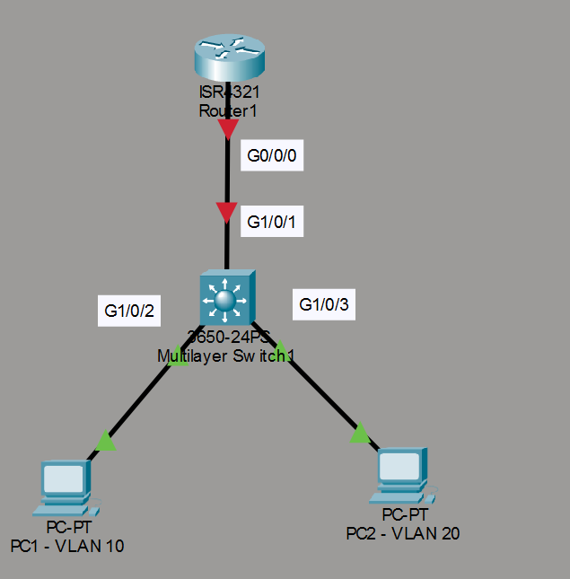
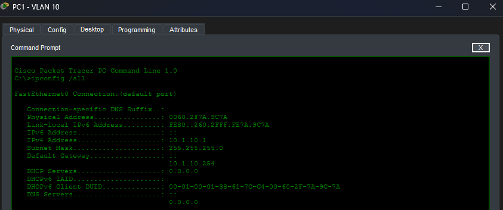
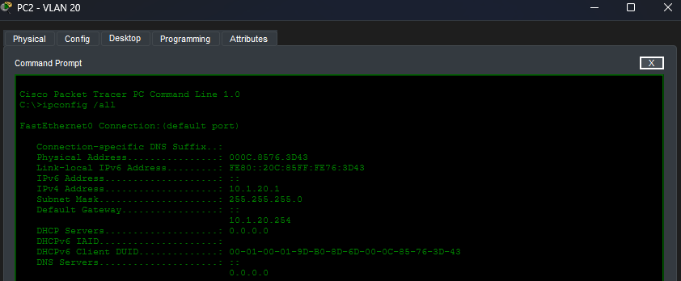
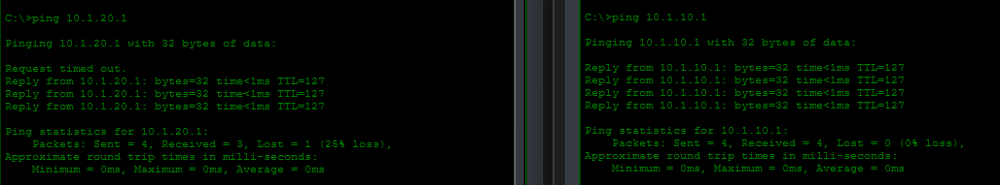
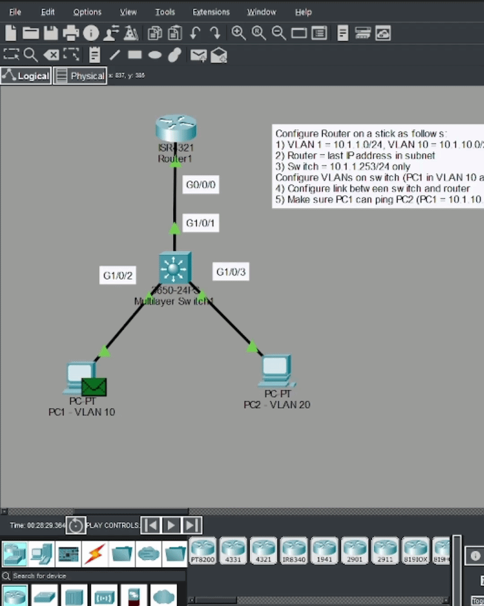

# Router on a Stick Lab

## Objetivo

Este laboratorio practica la configuración de *Router on a Stick*, una técnica que permite que un router enrute el tráfico entre varias VLANs a través de un único enlace físico. El laboratorio fue realizado a partir del material de David Bombal.

## Topología



## Tareas del laboratorio

Configurar *Router on a Stick* de la siguiente forma:

1. VLAN 1 = `10.1.1.0/24`, VLAN 10 = `10.1.10.0/24`, VLAN 20 = `10.1.20.0/24`.
2. El router utiliza la última dirección IP de cada subred.
3. El switch solo necesita la dirección `10.1.1.253/24`.
4. Configurar las VLANs en el switch (PC1 en la VLAN 10 y PC2 en la VLAN 20).
5. Configurar el enlace entre el switch y el router.
6. Comprobar que PC1 puede hacer `ping` a PC2 (PC1 = `10.1.10.1`, PC2 = `10.1.20.2`).

## Creación de las VLANs en el switch

Se asigna cada puerto de acceso a su VLAN y se configura la dirección IP de gestión del switch en la VLAN 1:

```text
S1(config)# int g1/0/2
S1(config-if)# sw mode access
S1(config-if)# sw access vlan 10
S1(config-if)# no shut
!
S1(config-if)# int g1/0/3
S1(config-if)# sw mode access
S1(config-if)# sw access vlan 20
S1(config-if)# no shut
!
S1(config)# int vlan 1
S1(config-if)# ip add 10.1.1.253 255.255.255.0
S1(config-if)# no shut
```

## Puerto trunk hacia el router

El enlace entre el switch y el router se configura como trunk, permitiendo únicamente el tráfico de las VLANs 10 y 20:

```text
S1(config)# int g1/0/1
S1(config-if)# sw mode trunk
S1(config-if)# no shut
S1(config-if)# switchport trunk allowed vlan 10,20
```

## Router on a Stick

En el router se crean subinterfaces, una por cada VLAN. Cada subinterface utiliza encapsulación `dot1q` con el identificador de su VLAN y la última dirección IP de la subred correspondiente:

```text
R1(config)# int g0/0/0
R1(config-if)# no shut
!
R1(config)# int g0/0/0.10
R1(config-subif)# encapsulation dot1q 10
R1(config-subif)# ip add 10.1.10.254 255.255.255.0
!
R1(config)# int g0/0/0.20
R1(config-subif)# encapsulation dot1Q 20
R1(config-subif)# ip add 10.1.20.254 255.255.255.0
!
R1(config)# int g0/0/0.1
R1(config-subif)# encapsulation dot1Q 1
R1(config-subif)# ip add 10.1.1.254 255.255.255.0
```

De esta forma, un único enlace físico transporta el tráfico de las tres VLANs, y el router se encarga de enrutar entre ellas.

## Configuración de los equipos

PC1 se configura en la VLAN 10 con la dirección `10.1.10.1` y PC2 en la VLAN 20 con la dirección `10.1.20.2`.





## Pruebas de conectividad

Las pruebas confirman que PC1 puede comunicarse con PC2 aunque estén en VLANs distintas, gracias al enrutamiento realizado por el router.



