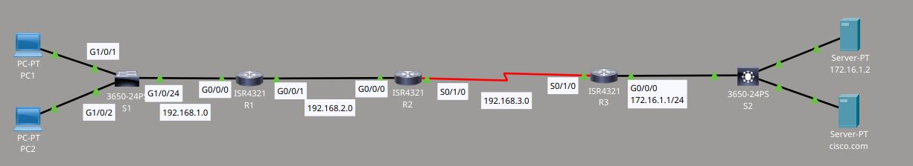
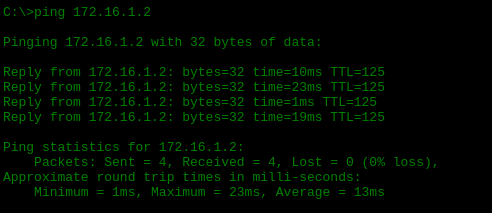
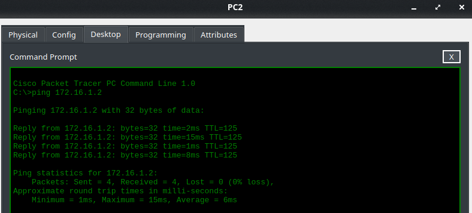
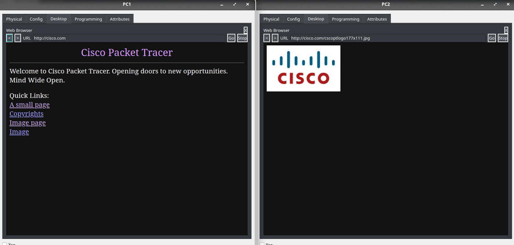
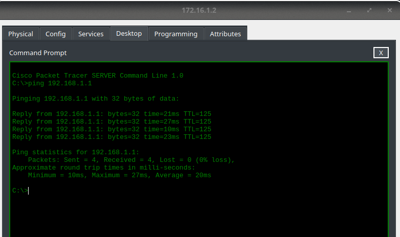

# Static Routing Basic Lab

Material proporcionado por **David Bombal**.

## Topología



### Requisitos

1. Las passwords deben configurarse como `cisco`.
2. Debo configurar las static routes usando next hop IP addresses. No debo usar default routes.

### Verificación

1. Comprobar que PC1 y PC2 pueden hacer browse a cisco.com usando su DNS name.
2. Comprobar que S1 puede hacer ping al DNS server en la dirección 172.16.1.2.

## Configuración

A continuación muestro los comandos que utilicé para configurar las static routes en cada router.

```cmd
R1(config-if)#ip route 172.16.1.0 255.255.255.0 192.168.2.2
R2(config)#ip route 172.16.1.0 255.255.255.0 s0/1/0 192.168.3.2
!
R3(config)#ip route 192.168.1.0 255.255.255.0 192.168.3.1
R2(config)#ip route 192.168.1.0 255.255.255.0 192.168.2.1
```

## Mis comprobaciones

Después de aplicar esta configuración, verifiqué que todo funcionara correctamente.

Primero, comprobé que PC1 puede hacer ping al DNS server (172.16.1.2):



Después, hice la misma comprobación desde PC2, con el mismo resultado satisfactorio:



A continuación, confirmé que ambos PCs pueden hacer browse a la página de cisco.com mediante su web browser:



Por último, como comprobación adicional, entré a la consola del DNS server y realicé un ping hacia PC1, que se encuentra en la red 192.168.1.0. El resultado fue igualmente satisfactorio:



Con estas pruebas, confirmo que las static routes quedaron correctamente configuradas y que existe conectividad completa entre todos los dispositivos de la topología.
