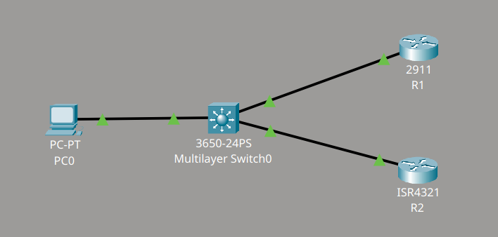
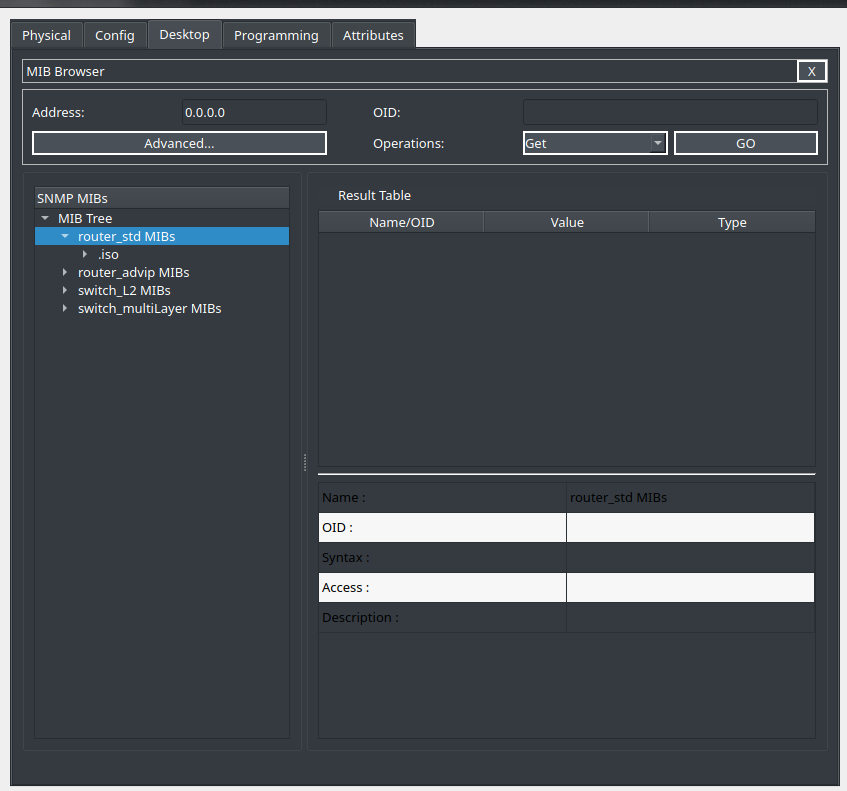
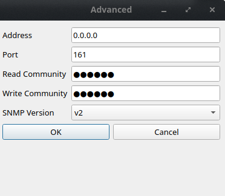
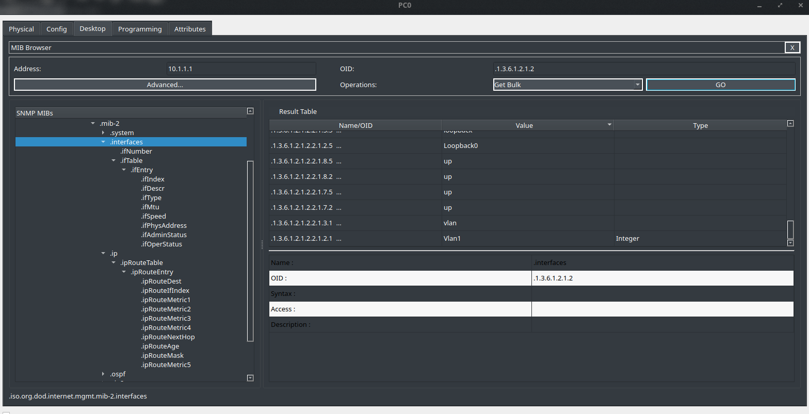
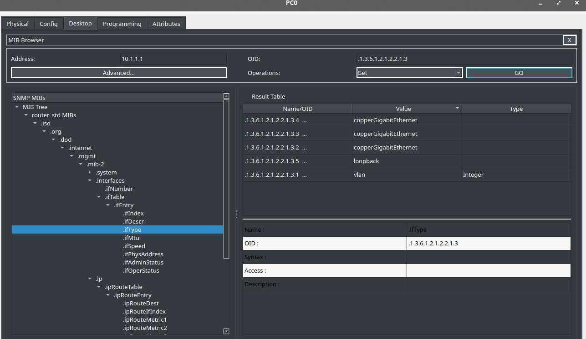
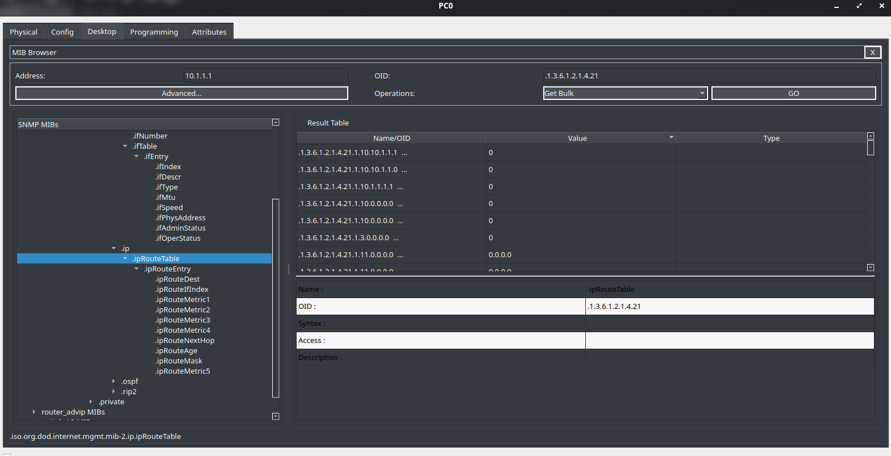
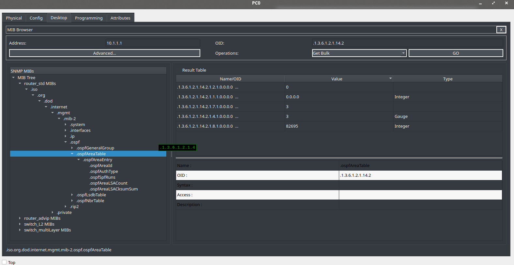
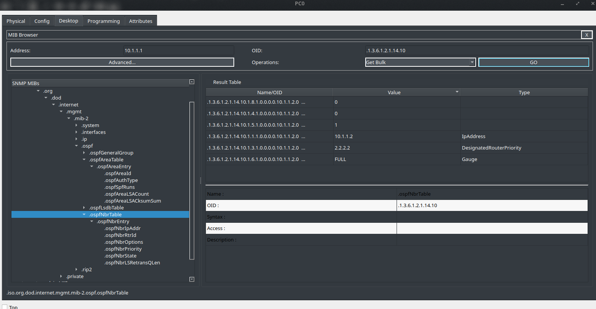
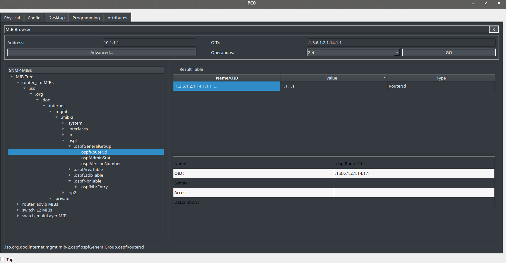
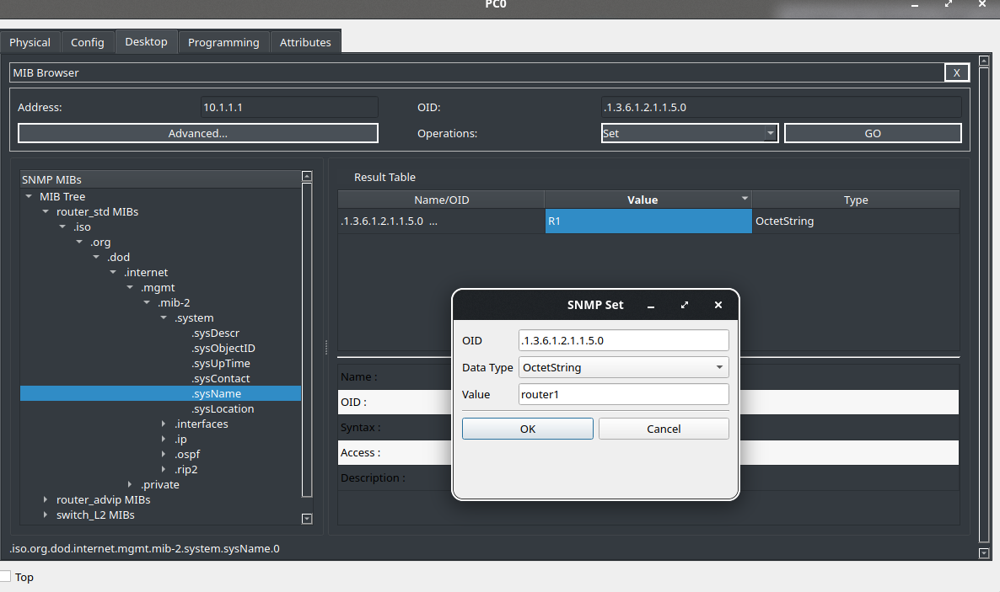

# SNMP Initial

## Descripción del lab

Material proporcionado por **David Bombal**.

Se debe completar el siguiente conjunto de tareas de SNMP:

1. Habilitar SNMP en R1 y R2, con las siguientes community strings:
   - Read Only (ro)
   - Read Write (rw)
2. Utilizar el MIB Browser (SNMP v3) del PC para consultar el hostname de R1 y R2.
3. Consultar las interfaces de R1 mediante el MIB Browser.
4. Consultar los tipos de interfaz de R1 mediante el MIB Browser.
5. Consultar la tabla de enrutamiento de R1 mediante el MIB Browser.
6. Consultar el OSPF Area de R1 mediante el MIB Browser.
7. Consultar el router-id de R1 mediante el MIB Browser.
8. Consultar los vecinos OSPF de R1 mediante el MIB Browser.
9. Cambiar el nombre de R1 a "Router1" utilizando el MIB Browser del PC.

## Topología




## Configuración de SNMP en los routers

En lugar de las community strings propuestas en el enunciado, he configurado las siguientes en R1 y R2:

```cmd
R1(config)#snmp-server community cisco1 ro
R1(config)#snmp-server community cisco2 rw
!
R2(config)#snmp-server community cisco1 ro
R2(config)#snmp-server community cisco2 rw
```

## Acceso al MIB Browser

Me dirijo al PC y accedo al MIB Browser, una aplicación situada junto al navegador web habitual. Al abrirla, aparece la ventana principal de la herramienta.



En el apartado "Advanced" configuro los parámetros de conexión: la dirección IP del equipo a consultar, el puerto, las community strings de lectura y escritura, y la versión de SNMP.

He utilizado la versión 2, ya que es la que conozco con más soltura. La versión 3 queda pendiente de estudio, pero para un lab de práctica considero que la versión 2 es suficiente.

En el campo "Address" indico la IP de R1, puesto que es el equipo que quiero consultar.



### Consulta de interfaces

Para consultar las interfaces de R1 accedo al nodo correspondiente del árbol MIB (interfaces). Dado que se trata de un volumen de datos considerable, utilizo la operación Get Bulk en lugar de Get, ya que con una consulta simple no obtendría toda la información.



### Consulta de los tipos de interfaz

Repito el proceso sobre el nodo ifType para obtener el tipo de cada interfaz (copperGigabitEthernet, loopback, vlan, etc.).



### Consulta de la tabla de enrutamiento

Consulto el nodo ipRouteTable, nuevamente con Get Bulk, para obtener la tabla de enrutamiento de R1.



### Consulta del OSPF Area

Consulto el nodo ospfAreaTable para obtener el área OSPF configurada en R1.



### Consulta de los vecinos OSPF

Consulto el nodo ospfNbrTable, donde compruebo el estado de la adyacencia (FULL) con el vecino correspondiente.



### Consulta del router-id

Consulto el nodo ospfRouterId para obtener el router-id de R1.



### Cambio del hostname mediante SNMP

Por último, cambio el hostname de R1 mediante una operación Set sobre el nodo sysName. Es importante seleccionar el Data Type correcto para que el cambio se aplique; en este caso, el Data Type es OctetString.



Para verificar el cambio, accedo a la terminal del router y compruebo que el hostname se ha actualizado correctamente.


