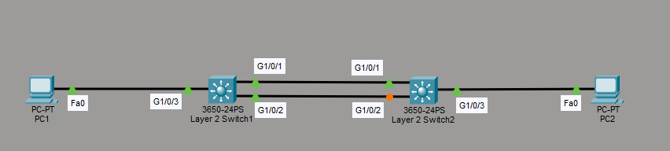
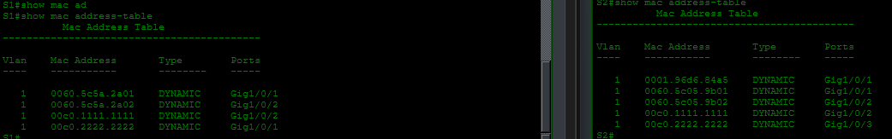

# Desactivación de STP

## Objetivo

Este laboratorio muestra la importancia de **Spanning Tree Protocol (STP)** en una red Ethernet y las consecuencias de desactivarlo.

> **Advertencia:** Realice este laboratorio únicamente en un entorno de pruebas. Desactivar STP puede provocar una tormenta de broadcast y afectar gravemente al funcionamiento de la red.

## Topología



## Configuración inicial

Antes de realizar la prueba, se configura el servicio DHCP en el switch de capa 3:

```text
S1(config)# ip dhcp excluded-address 192.168.10.1 192.168.10.10
S1(config)# ip dhcp pool RED10
S1(dhcp-config)# network 192.168.10.0 255.255.255.0
S1(dhcp-config)# default-router 192.168.10.1
S1(dhcp-config)# exit
```

Las direcciones IP asignadas a los equipos son:

| Equipo | Dirección IP |
|---|---|
| PC1 | `192.168.10.11` |
| PC2 | `192.168.10.12` |

## Desactivación de STP

Se desactiva STP para la VLAN 1 en ambos switches:

```text
S1(config)# no spanning-tree vlan 1
!
S2(config)# no spanning-tree vlan 1
```

## Observaciones

Al enviar un ping desde un equipo hacia PC2, PC1 debe resolver primero la dirección MAC de destino. Para ello, genera una solicitud ARP, que se transmite como broadcast.

Con STP desactivado, los switches reciben y reenvían estos broadcasts por todos sus puertos. Como todos los puertos permanecen en estado de reenvío, las tramas pueden circular continuamente entre los switches. Esto provoca una **tormenta de broadcast**.

También se observa que la tabla de direcciones MAC cambia de forma constante. El switch aprende la misma dirección MAC por diferentes puertos, lo que produce **MAC address flapping**. En una red de mayor tamaño, este comportamiento puede causar inestabilidad y pérdida de conectividad.



## Conclusión

STP evita los bucles de capa 2 y mantiene algunos enlaces bloqueados cuando es necesario. Desactivarlo en una topología redundante elimina esa protección y puede generar tormentas de broadcast, cambios continuos en la tabla MAC y una interrupción general del servicio.
