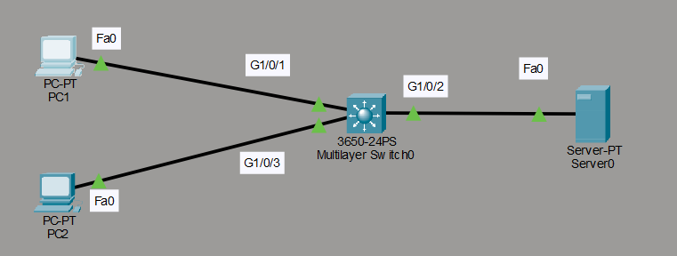
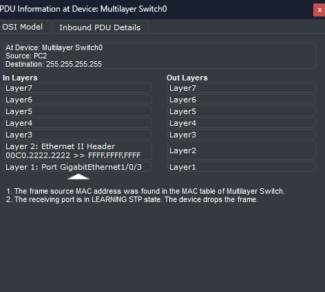
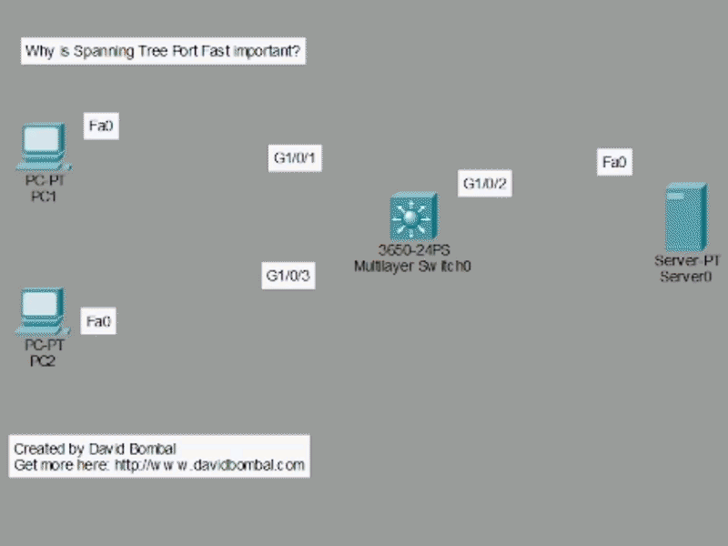

# PortFast

## Topología



Material de **David Bombal**.

## Descripción del laboratorio

Este laboratorio muestra el comportamiento de Spanning Tree Protocol (STP) en un puerto de acceso conectado a un equipo final, y cómo la función PortFast permite evitar los retrasos habituales de convergencia en ese tipo de conexión.

## Comportamiento sin PortFast

Al analizar el tráfico capturado durante una solicitud de `ipconfig /renew` en el PC2, se observa que el paquete llega al switch, pero este no puede reenviarlo de inmediato. El motivo es que el puerto se encuentra todavía en el estado de aprendizaje (*learning*).

Spanning Tree Protocol dispone de dos estados de transición antes de permitir el reenvío de tráfico: el estado de escucha (*listening*) y el estado de aprendizaje (*learning*). Un puerto debe atravesar ambos estados antes de alcanzar el estado de reenvío (*forwarding*).



## La función PortFast

Spanning Tree Protocol incluye una función pensada para los puertos que no se conectan a otro switch, sino a un equipo final, como un ordenador o un servidor. En estos casos, no es necesario pasar por los estados de escucha y aprendizaje: el puerto puede pasar directamente al estado de reenvío. Esta función se conoce como PortFast.

## Configuración de PortFast

```cmd
Switch(config)#int range g1/0/1-3
Switch(config-if-range)#sw mode access
Switch(config)#spanning-tree portfast default
```

En este laboratorio, la configuración se ha aplicado de forma global a todos los puertos de acceso mediante el comando `spanning-tree portfast default`, con el fin de agilizar el proceso. Como alternativa, es posible configurar PortFast puerto por puerto, activando primero el modo de acceso y aplicando después el comando `spanning-tree portfast` directamente sobre la interfaz correspondiente.

## Resultado



Como se aprecia en la animación, una vez configurado PortFast en las tres interfaces, estas ya no necesitan recorrer los estados de escucha y aprendizaje. El puerto alcanza el estado de reenvío de manera inmediata.
