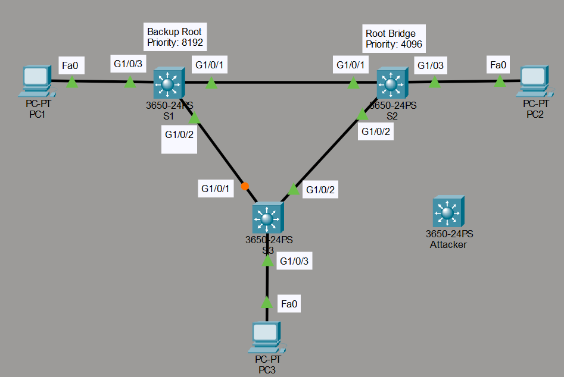
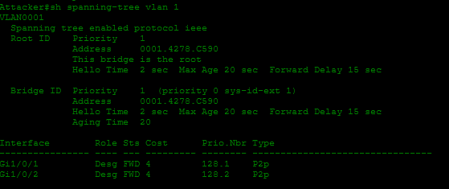
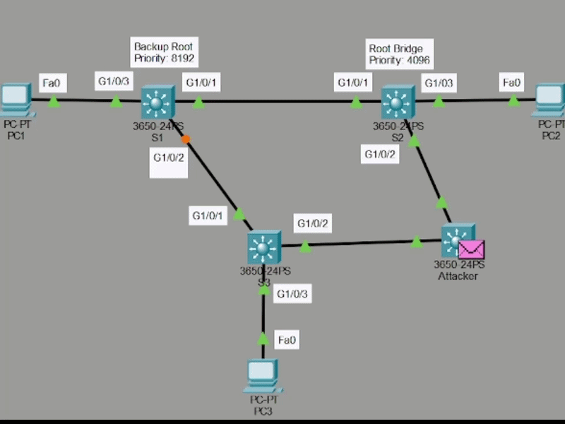
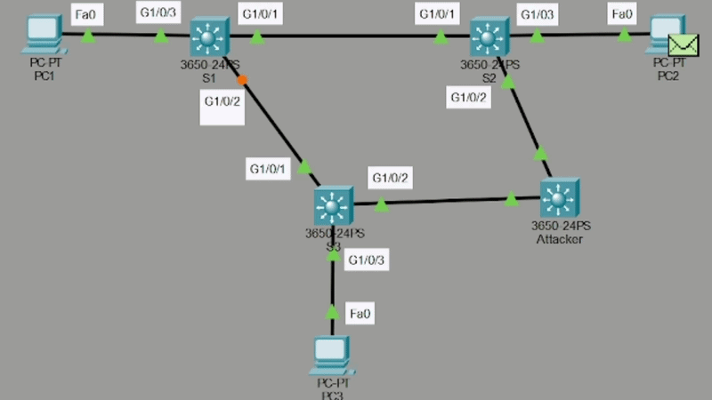
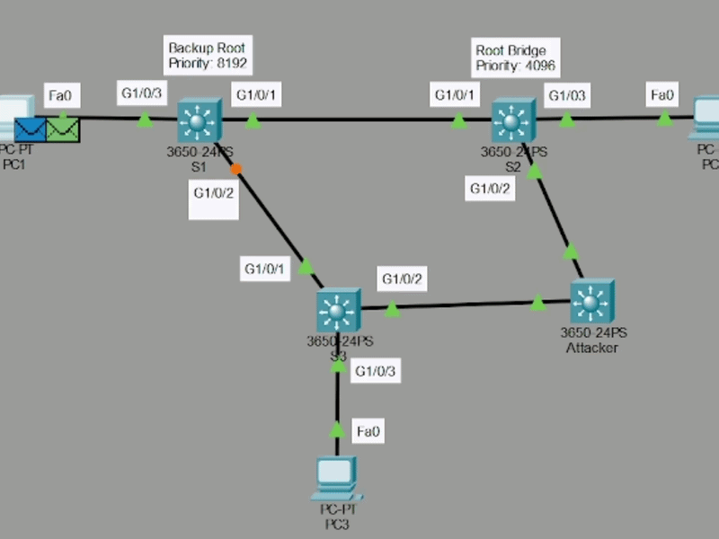
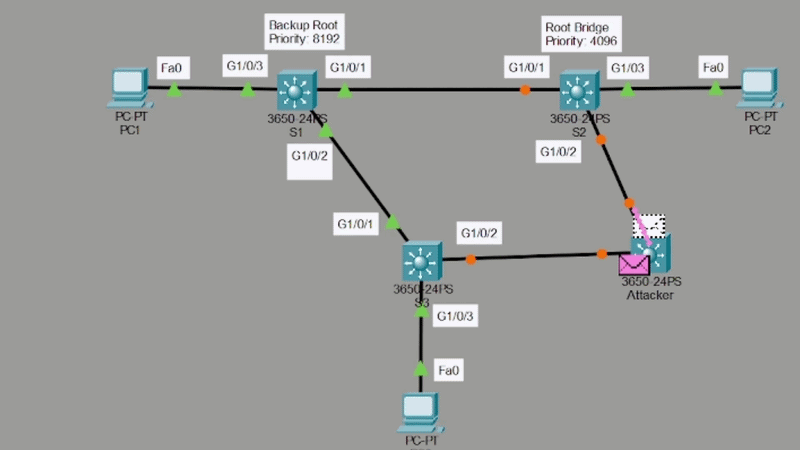
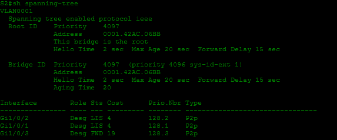
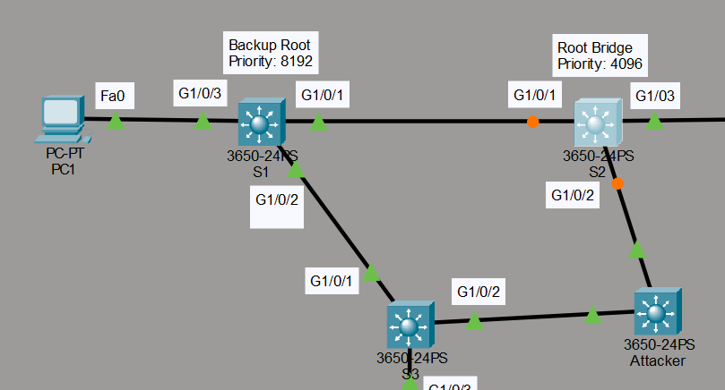
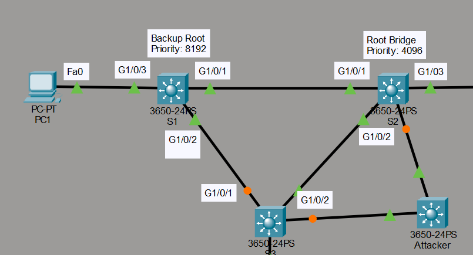

# STP Root Guard

## Descripción

Este laboratorio muestra un ataque contra el protocolo Spanning Tree (STP) y la manera de prevenirlo mediante la función Root Guard. Se simula la conexión de un switch atacante con una bridge priority muy baja, lo que le permite convertirse en el puente raíz y capturar el tráfico de la red. Después, se aplica Root Guard en los switches legítimos para bloquear este tipo de ataque. Material basado en el curso de David Bombal.

## Topología



## Fase 1: Ataque al puente raíz

En esta primera fase, mi objetivo es demostrar cómo un switch no autorizado puede tomar el control de la topología STP.

### Configuración aplicada

```cmd
Attacker(config)#spanning-tree vlan 1 priority 0
```

Con este comando, asigno al switch atacante la prioridad más baja posible en la VLAN 1. Como resultado, el switch atacante se convierte en el puente raíz de la red, ya que ningún otro equipo tiene una prioridad menor.





### Consecuencias del ataque

Una vez que el switch atacante se convierte en el puente raíz, todo el tráfico entre PC1, PC2 y PC3 pasa a través de él. Esta situación es grave, porque permite a un atacante capturar y analizar el tráfico completo de la red simplemente conectando un switch con una bridge priority muy baja.





## Fase 2: Protección con Root Guard

Tras comprobar el impacto del ataque, procedí a implementar Root Guard como medida de protección.

### Configuración aplicada

```cmd
S2(config)#int range g1/0/1-24
S2(config-if-range)#spanning-tree guard root
!
S1(config)#int range g1/0/3-24
S1(config-if-range)#spanning-tree guard root
!
S3(config)#int range g1/0/3-24
S3(config-if-range)#spanning-tree guard root
```



### Resultado de la protección

Con esta configuración, S2 bloquea cualquier BPDU superior que reciba, es decir, cualquier anuncio de un puente con mejor prioridad que el suyo. Cuando conecté de nuevo el switch atacante, este envió una BPDU con una prioridad mejor que la de S1, por lo que S2 bloqueó el enlace correspondiente. El enlace entre S3 y el switch atacante tardó unos instantes en estabilizarse, pero finalmente funcionó con normalidad, ya que en ese punto no había capturado todavía todo el proceso en la grabación.

A continuación, repetí la prueba conectando el switch atacante mediante otros puertos: el puerto G1/0/4 de S3 y el puerto G1/0/4 de S2. El resultado fue el mismo, ya que la red trató la conexión de la misma manera y bloqueó el tráfico.

En el switch configurado como puente raíz, con Root Guard activado en todos sus puertos, observé que este bloqueaba el tráfico en dichas interfaces. Esto ocurrió porque, al conectar el switch atacante, este anunciaba una mejor bridge priority que la del switch raíz legítimo. Por el contrario, el enlace entre S3 y el switch atacante no se bloqueó, ya que en esa conexión no había configurado Root Guard.





Finalmente, comprobé que los enlaces entre S3, S2 y el switch atacante quedaron en estado "root inconsistent". En este estado, ambos switches bloquean cualquier tipo de tráfico, ya que el switch atacante anuncia una mejor bridge priority y los puertos correspondientes tienen Root Guard configurado.

