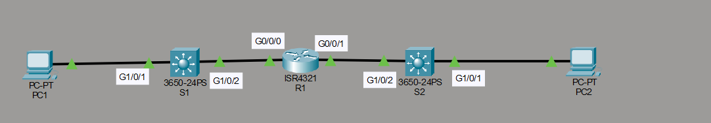
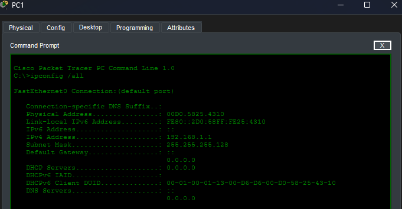
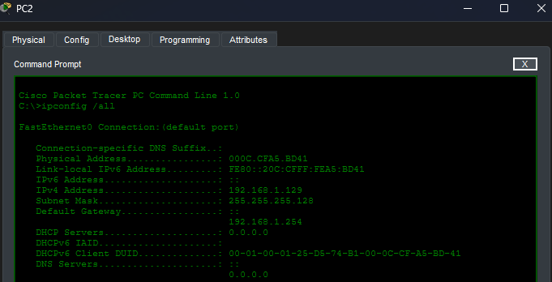
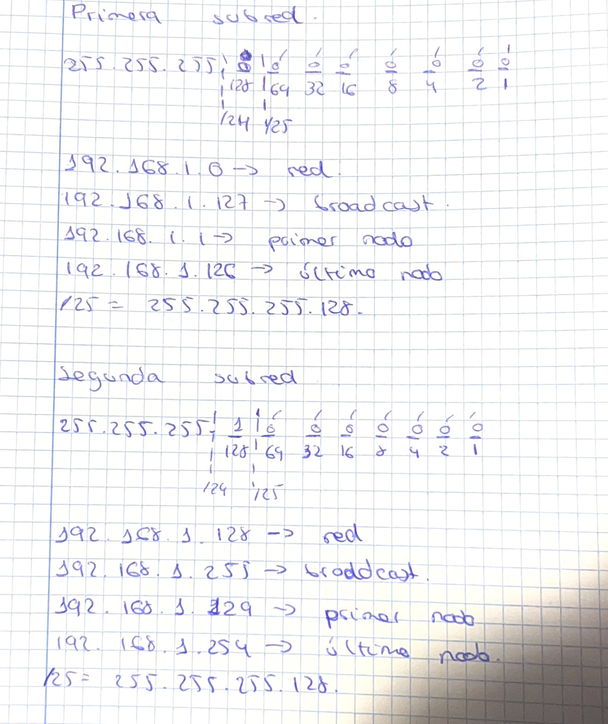

# Subnetting Basic Lab 1

## Topología


## Objetivo

Este laboratorio practica la división de una red en subredes más pequeñas mediante el uso de una máscara de subred. El laboratorio fue realizado a partir del material de David Bombal.

## Tareas del laboratorio

1. Dividir la red actual `192.168.1.0/24` en dos subredes con el mayor número de hosts posible.
2. Asignar la primera subred al lado izquierdo (S1) y la segunda subred al lado derecho (S2).
3. Configurar los equipos con la primera dirección IP disponible de su subred.
4. Configurar el router con la última dirección IP disponible de cada subred.
5. Conectar el router entre los dos switches.
6. Configurar los switches con la penúltima dirección IP disponible de cada subred.
7. Verificar que todos los dispositivos puedan hacer `ping` entre sí.

## División de la red

La red `192.168.1.0/24` se divide en dos subredes con máscara `255.255.255.128` (`/25`). Cada subred dispone de 126 direcciones utilizables.

| Subred | Red | Rango de direcciones utilizables | Broadcast |
|---|---|---|---|
| S1 (izquierda) | `192.168.1.0/25` | `192.168.1.1` a `192.168.1.126` | `192.168.1.127` |
| S2 (derecha) | `192.168.1.128/25` | `192.168.1.129` a `192.168.1.254` | `192.168.1.255` |

## Configuración del router

```text
R1(config)# int g0/0/0
R1(config-if)# ip add 192.168.1.126 255.255.255.128
R1(config-if)# no shut
!
R1(config-if)# int g0/0/1
R1(config-if)# ip add 192.168.1.254 255.255.255.128
R1(config-if)# no shut
```

La interfaz `g0/0/0` se conecta a la subred S1 y la interfaz `g0/0/1` se conecta a la subred S2.

## Configuración de los equipos

PC1 se configura con la primera dirección IP de la subred S1.



PC2 se configura con la primera dirección IP de la subred S2.



## Configuración de los switches (SVI)

```text
SWL3(config)# int vlan 1
SWL3(config-if)# ip add 192.168.1.125 255.255.255.128
SWL3(config-if)# no shut
SWL3(config)# ip routing
!
SWL3_2(config)# int vlan 1
SWL3_2(config-if)# ip address 192.168.1.253 255.255.255.128
SWL3_2(config-if)# no shut
SWL3_2(config)# ip routing
```



Con el direccionamiento finalizado, cada dispositivo puede comunicarse con los demás mediante `ping`.

## Direccionamiento final

| Dispositivo | Interfaz | Subred | Dirección IP |
|---|---|---|---|
| PC1 | — | S1 | `192.168.1.1` |
| SWL3 | SVI VLAN 1 | S1 | `192.168.1.125` |
| R1 | g0/0/0 | S1 | `192.168.1.126` |
| PC2 | — | S2 | `192.168.1.129` |
| SWL3_2 | SVI VLAN 1 | S2 | `192.168.1.253` |
| R1 | g0/0/1 | S2 | `192.168.1.254` |
