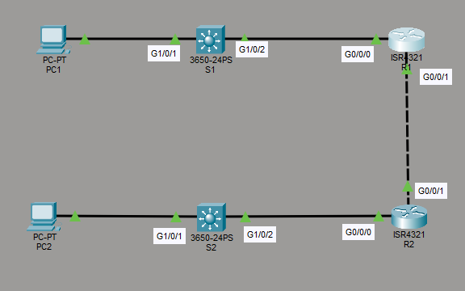
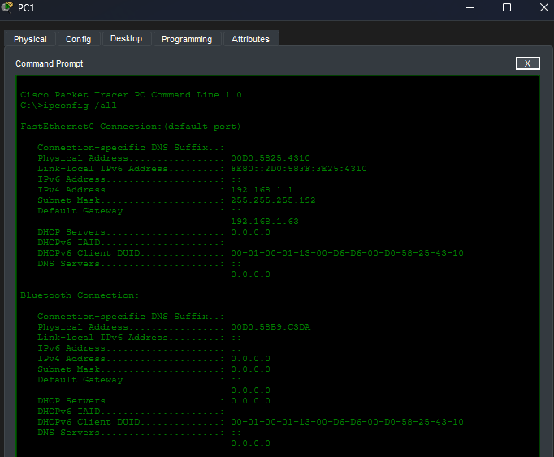
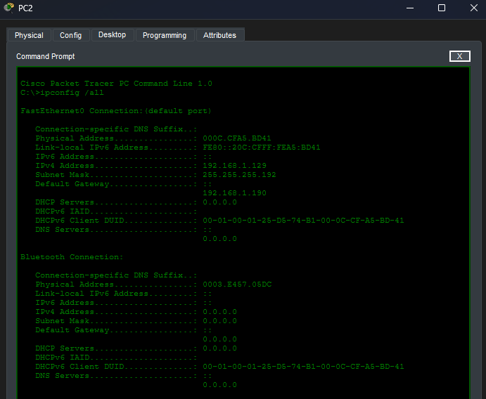
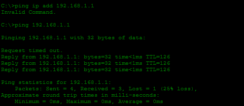
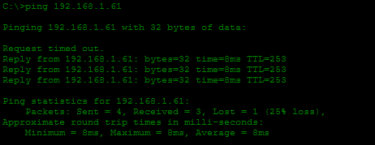
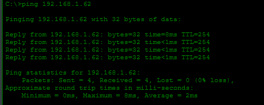
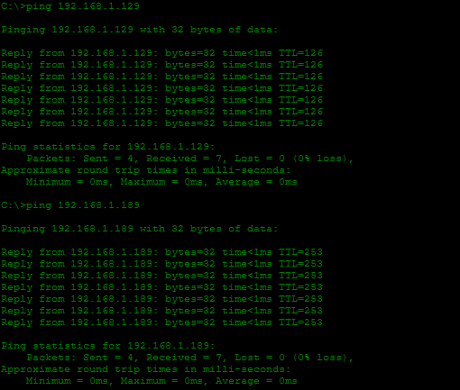
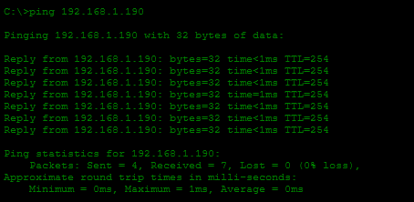
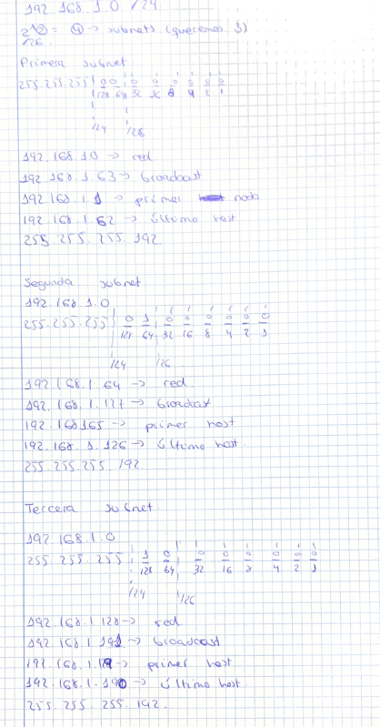

# Subnetting Lab 2

## Objetivo

Este laboratorio practica la división de una red en tres subredes y la configuración de los dispositivos para que puedan comunicarse entre sí. El laboratorio fue realizado a partir del material de David Bombal.

## Topología



## Tareas del laboratorio

1. Dividir la red `192.168.1.0/24` en tres subredes.
2. Asignar la primera subred a PC1, S1 y R1. La segunda subred se utiliza para el enlace entre los routers. La tercera subred se asigna a PC2, S2 y R2.
3. Configurar los equipos con la primera dirección IP disponible de su subred.
4. Configurar los routers con la última dirección IP disponible de cada subred en las conexiones hacia los equipos.
5. En el enlace entre routers, configurar R1 con la primera dirección IP de la subred y R2 con la segunda dirección IP.
6. Configurar los switches con la penúltima dirección IP disponible de cada subred.
7. Verificar que todos los dispositivos puedan hacer `ping` entre sí.

## División de la red

La red `192.168.1.0/24` se divide en tres subredes con máscara `255.255.255.192` (`/26`). Cada subred dispone de 62 direcciones utilizables.

| Subred | Red | Rango de direcciones utilizables | Broadcast |
|---|---|---|---|
| Subred 1 | `192.168.1.0/26` | `192.168.1.1` a `192.168.1.62` | `192.168.1.63` |
| Subred 2 | `192.168.1.64/26` | `192.168.1.65` a `192.168.1.126` | `192.168.1.127` |
| Subred 3 | `192.168.1.128/26` | `192.168.1.129` a `192.168.1.190` | `192.168.1.191` |

## Configuración de la primera subred

```text
R1(config)# int g0/0/0
R1(config-if)# ip add 192.168.1.62 255.255.255.192
R1(config-if)# no shut
!
S1(config)# int vlan 1
S1(config-if)# ip add 192.168.1.61 255.255.255.192
S1(config-if)# no shut
S1(config)# ip routing
```

PC1 se configura con la primera dirección IP de la subred 1.



## Configuración de la segunda subred (enlace entre routers)

```text
R1(config-if)# int g0/0/1
R1(config-if)# ip add 192.168.1.65 255.255.255.192
R1(config-if)# no shut
!
R2(config)# int g0/0/1
R2(config-if)# ip add 192.168.1.66 255.255.255.192
R2(config-if)# no shut
```

En el enlace entre routers, R1 utiliza la primera dirección IP disponible de la subred y R2 la segunda.

## Configuración de la tercera subred

```text
R2(config-if)# int g0/0/0
R2(config-if)# ip add 192.168.1.190 255.255.255.192
R2(config-if)# no shut
!
S2(config)# int vlan 1
S2(config-if)# ip add 192.168.1.189 255.255.255.192
S2(config-if)# no shut
S2(config)# ip routing
```

PC2 se configura con la primera dirección IP de la subred 3.



## Direccionamiento final

| Dispositivo | Interfaz | Subred | Dirección IP |
|---|---|---|---|
| PC1 | — | Subred 1 | `192.168.1.1` |
| S1 | SVI VLAN 1 | Subred 1 | `192.168.1.61` |
| R1 | g0/0/0 | Subred 1 | `192.168.1.62` |
| R1 | g0/0/1 | Subred 2 | `192.168.1.65` |
| R2 | g0/0/1 | Subred 2 | `192.168.1.66` |
| PC2 | — | Subred 3 | `192.168.1.129` |
| S2 | SVI VLAN 1 | Subred 3 | `192.168.1.189` |
| R2 | g0/0/0 | Subred 3 | `192.168.1.190` |

## Configuración de OSPF

Para que los dispositivos de las tres subredes puedan comunicarse, los switches de capa 3 se configuran con el protocolo de routing OSPF.

```text
S1(config)# router ospf 1
S1(config-router)# router-id 1.1.1.1
S1(config-router)# network 192.168.1.0 0.0.0.63 area 0
!
S2(config)# router ospf 1
S2(config-router)# router-id 2.2.2.2
S2(config-router)# network 192.168.1.128 0.0.0.63 area 0
```

## Pruebas de conectividad

Los siguientes resultados muestran las pruebas de conectividad realizadas desde los equipos una vez configurada la red.











## Cálculos

