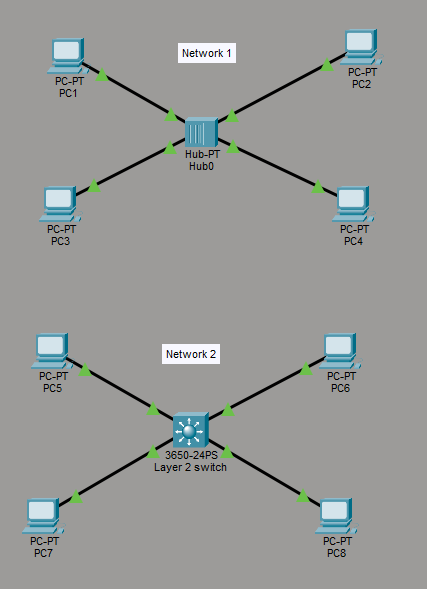
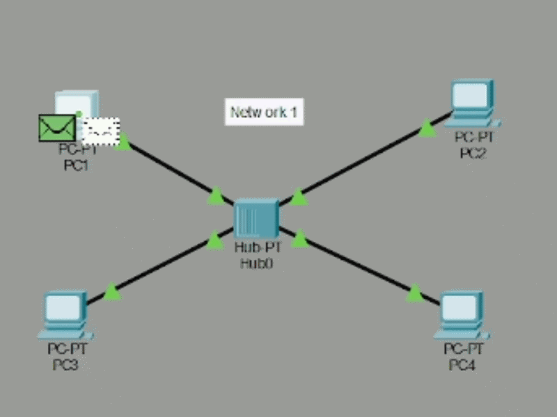
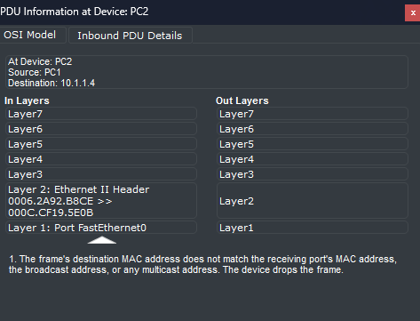
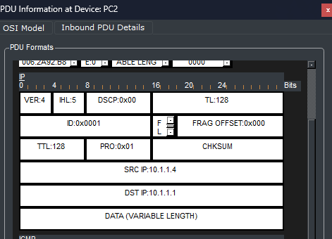
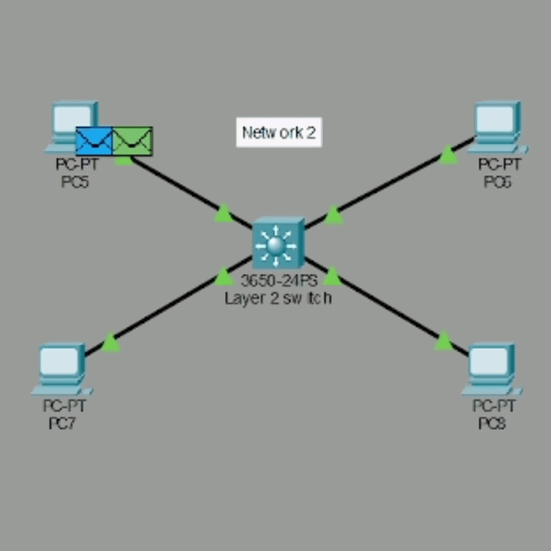
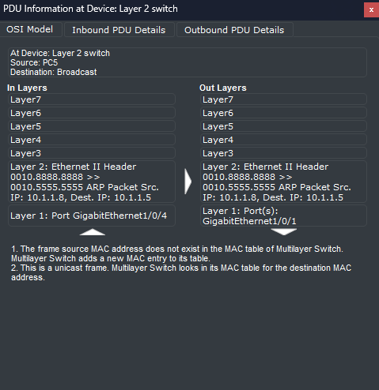
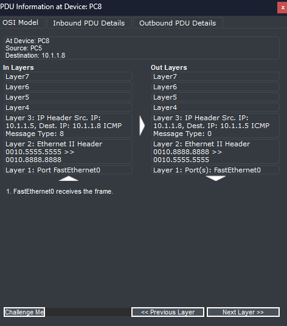
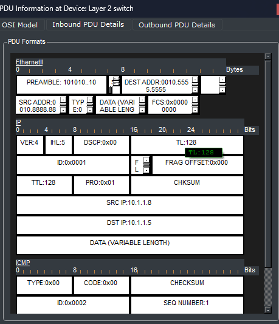

# Broadcast and Collision Domains

## Objetivo

Este laboratorio analiza el comportamiento del tráfico en dos redes distintas: una formada por un *hub* y otra formada por un switch de capa 2. Se estudia cómo se propagan las solicitudes ARP y los paquetes ICMP, y se identifican los dominios de broadcast y de colisión de cada red. El laboratorio fue realizado a partir del material de David Bombal.

## Topología

## Preguntas del ejercicio

Se asume que todos los dispositivos se han reiniciado (esto puede simularse con el botón *Power Cycle Devices* de Packet Tracer). No basta con responder: hay que demostrarlo.

1. Cuando PC1 hace `ping` a PC4, ¿qué tipo de paquete se envía inicialmente al hub? ¿Puede demostrarse?
2. ¿Quién recibe ese paquete?
3. ¿Quién recibe el tráfico de respuesta de PC4 hacia PC1?
4. Cuando se envía el tráfico del `ping` de PC1 a PC4, ¿quién lo recibe?
5. Suponiendo que la tabla MAC del Switch 1 está vacía: cuando PC5 hace `ping` a PC8, ¿qué tipo de paquete se envía inicialmente al switch? ¿Puede demostrarse?
6. ¿Quién recibe ese paquete?
7. ¿Quién recibe el tráfico de respuesta de PC8 hacia PC5?
8. Cuando se envía el tráfico del `ping` de PC5 a PC8, ¿quién lo recibe?

9. ¿Cuántos dominios de broadcast hay en la Red 1? ¿Puede demostrarse?
10. ¿Cuántos dominios de broadcast hay en la Red 2? ¿Puede demostrarse?
11. ¿Cuántos dominios de colisión hay en la Red 1 y en la Red 2? ¿Puede demostrarse?

## Red 1: red con hub

Al hacer `ping` desde PC1 a PC4, como PC1 no conoce la dirección MAC de PC4, debe enviar primero una solicitud ARP. Esta solicitud es un mensaje broadcast, por lo que el hub la reenvía por todos sus puertos hacia todos los equipos de la red.

Cuando PC4 responde con un **ARP Reply**, este mensaje es por naturaleza unicast. Sin embargo, al llegar al hub, el dispositivo lo reenvía también por todos los puertos, excepto por aquel donde se originó la respuesta. Es decir, el hub convierte todo el tráfico que le llega en broadcast, independientemente del tipo de mensaje original.

Si se inspeccionan los paquetes ICMP que llegan desde PC4 hasta el hub, se observa que los equipos que no eran el destino (los que no tienen la dirección MAC correspondiente) descartan los paquetes. En los detalles de entrada (*inbound details*) del paquete IP se confirma que la dirección IP de destino es la de PC1.

**Conclusión de esta parte:** el ARP request inicial es broadcast, todos los hosts lo reciben, y tanto la respuesta ARP como el resto del tráfico son reenviados a todos los hosts por el comportamiento propio del hub.

## Red 2: red con switch de capa 2

Cuando PC5 envía un `ping` a PC8, primero envía una solicitud ARP para conocer la dirección MAC de PC8. Al llegar al switch, este la reenvía por todos los puertos. Este comportamiento es normal, ya que una solicitud ARP es por sí misma un mensaje broadcast.

Cuando PC8 responde con el ARP Reply, el switch ya conoce el puerto asociado a PC5 y lo entrega directamente, sin necesidad de reenviarlo a todos los nodos. Este es el comportamiento habitual de un switch de capa 2.

Posteriormente, los mensajes ICMP Echo Request y ICMP Echo Reply circulan únicamente entre PC5 y PC8: cada uno pasa por el switch, que lo reenvía solo por la interfaz del destinatario.

Inspeccionando los paquetes ICMP se comprueba que el switch entrega cada trama directamente hacia la IP y la MAC correctas, sin realizar ninguna difusión.

**Conclusión de esta parte:** el ARP request inicial es broadcast y lo reciben todos; sin embargo, tanto la respuesta ARP como el resto del tráfico viajan únicamente entre PC5 y PC8, porque el switch reenvía cada trama solo por su puerto de destino.

## Dominios de broadcast y de colisión

**Dominios de broadcast**

- **Red 1:** existe un único dominio de broadcast. Como demuestran los GIF anteriores, cualquier mensaje enviado por el hub alcanza a todos los nodos de la red.
- **Red 2:** también existe un único dominio de broadcast. La solicitud ARP enviada por PC5 se propaga a todos los nodos, ya que un switch difunde los mensajes broadcast por todos sus puertos.

**Dominios de colisión**

- **Red 1:** existe un único dominio de colisión. Todas las conexiones comparten el mismo medio a través del hub, formando una zona común donde dos o más dispositivos se estorban si transmiten a la vez.
- **Red 2:** existen cuatro dominios de colisión. Cada enlace entre un equipo y el switch constituye un dominio de colisión independiente, ya que en cada uno solo hay dos extremos y no se estorban entre enlaces distintos.