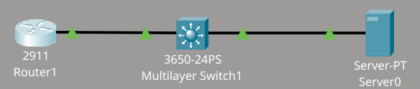
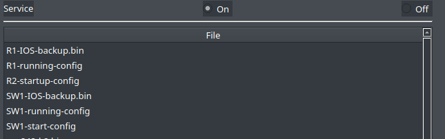
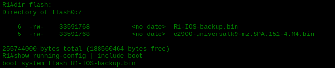
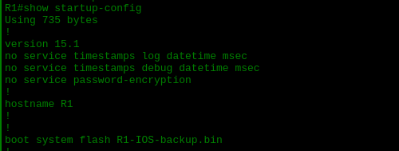
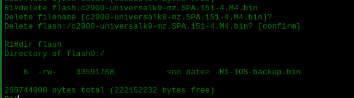

# Backup and Restore de Configuraciones y Sistemas Operativos

Material proporcionado por **David Bombal**.

## Descripción del lab

Este laboratorio consiste en realizar el backup de las configuraciones (running y startup) y del IOS de un router y un switch mediante TFTP, verificar que dichos archivos se han almacenado correctamente en el servidor y, posteriormente, practicar el proceso de restore de dichas configuraciones. También se realiza una actualización del IOS del router siguiendo el procedimiento adecuado.

### Tarea 1

1. Hacer backup de la running configuration y de la startup configuration del router y del switch.
2. Hacer backup del sistema operativo (IOS) del router y del switch.
3. Verificar que las configuraciones y los sistemas operativos se encuentren en el servidor TFTP.

### Tarea 2

1. Crear una interfaz loopback en el router con dirección IP 1.1.1.1/32.
2. Guardar la configuración del router.
3. Verificar que la startup configuration muestra la interfaz loopback.
4. Copiar la startup configuration desde el servidor TFTP hacia la startup configuration del router.
5. Verificar que la startup configuration ya no contiene la interfaz loopback.
6. Copiar la running configuration actual hacia el servidor TFTP.
7. Eliminar la interfaz loopback del router.
8. Copiar la nueva running configuration desde el servidor TFTP hacia la running configuration del router.
9. Comprobar si la interfaz loopback ha sido añadida de nuevo a la configuración del router.
10. Copiar la running configuration anterior desde el servidor TFTP hacia la running configuration del router.
11. Comprobar si la interfaz loopback ha sido eliminada y explicar por qué.

### Tarea 3

1. Actualizar el IOS del router a la versión c2900-universalk9-mz.SPA.155-3.M4a.bin, manteniendo el IOS actual en la memoria flash.
2. Emplear los comandos de boot correspondientes para asegurar que el router arranque con el nuevo IOS.
3. Reiniciar el router y confirmar que efectivamente arranca con el nuevo IOS.

## Topología



## Desarrollo del laboratorio

### Verificación inicial

Lo primero que he hecho ha sido identificar la dirección IP del servidor TFTP y comprobar que el switch y el router disponían de direcciones IP dentro de la misma red. Tras confirmarlo, he realizado un ping desde el router y desde el switch hacia el servidor, y en ambos casos la comunicación se ha establecido correctamente.

### Backup de las configuraciones

A continuación he ejecutado los siguientes comandos para hacer backup de la running configuration y de la startup configuration del router y del switch:

```cmd
R1#copy running-config tftp:
Address or name of remote host []? 10.1.1.100
Destination filename [R1-confg]? R1-running-config
Writing running-config...!!
[OK - 698 bytes]
698 bytes copied in 0 secs

!
R1#copy startup-config tftp:
Address or name of remote host []? 10.1.1.100
Destination filename [R1-confg]? R2-startup-config
Writing startup-config...!!
[OK - 694 bytes]
!!!!
S1#copy running-config tftp:
Address or name of remote host []? 10.1.1.100
Destination filename [S1-confg]? SW1-running-config
Writing running-config...!!
[OK - 1387 bytes]
1387 bytes copied in 0 secs
!
S1#copy startup-config tftp:
Address or name of remote host []? 10.1.1.100
Destination filename [S1-confg]? SW1-start-config
Writing startup-config...!!
[OK - 1369 bytes]
1369 bytes copied in 0 secs
```

### Backup del IOS

Después he hecho backup del IOS del router y del switch de la siguiente manera:

```cmd
R1#copy flash: tftp:
Source filename []? c2900-universalk9-mz.SPA.151-4.M4.bin
Address or name of remote host []? 10.1.1.100
Destination filename [c2900-universalk9-mz.SPA.151-4.M4.bin]? R1-IOS-backup.bin
!
S1#copy flash: tftp:
Source filename []? cat3k_caa-universalk9.16.03.02.SPA.bin
Address or name of remote host []? 10.1.1.100
Destination filename [cat3k_caa-universalk9.16.03.02.SPA.bin]? SW1-IOS-backup.bin
```

Una vez transferidos todos los archivos (running configuration, startup configuration del switch y del router, así como el IOS de ambos equipos), he verificado que estuvieran presentes en el servidor TFTP, y he confirmado que efectivamente se encontraban ahí.



### Creación de la interfaz loopback

Posteriormente he accedido al router y he creado una interfaz loopback. La he guardado mediante el comando `write memory` y he comprobado que aparecía tanto en la running configuration como en la startup configuration, tal como se observa a continuación:

```cmd
R1#sh run
interface Loopback0
ip address 1.1.1.1 255.255.255.255
!
R1#sh startup-config
interface Loopback0
ip address 1.1.1.1 255.255.255.255
```

### Incidencia durante el proceso de restore

En este punto he cometido un error: en lugar de enviar la running configuration actual al servidor TFTP, he copiado directamente el archivo que ya tenía almacenado en el servidor. Al revisar la running configuration tras esta copia, he observado que se mantenía prácticamente igual, incluyendo la interfaz loopback configurada. Por ello, he decidido eliminarla.

Al repetir el proceso y copiar de nuevo la running configuration desde el servidor TFTP, he comprobado que esta vez la interfaz loopback ya no estaba presente. La explicación es la siguiente:

> La configuración obtenida desde el servidor TFTP se **carga sobre la running configuration actual**. No se trata de un reemplazo completo de la configuración, sino de una superposición. Por este motivo pueden permanecer comandos que ya existían previamente en la running configuration y que no aparecen en el archivo TFTP.

En definitiva, sin proponérmelo, he copiado el backup almacenado en el servidor TFTP en lugar de seguir los pasos indicacdos por David Bombal en la descripción del ejercicio. No obstante, el procedimiento es equivalente: consiste en copiar el archivo del servidor TFTP hacia la memoria flash del router, aplicar los comandos de boot correspondientes y, finalmente, verificar en la memoria flash que ambos archivos (el traído del servidor y el que ya tenía el router) permiten arrancar el equipo con el mismo IOS.

```cmd
R1#sh startup-config
interface GigabitEthernet0/0
ip address 10.1.1.1 255.255.255.0
!!!!
R1#copy tftp: running-config
Address or name of remote host []? 10.1.1.100
Source filename []? R1-running-config
Destination filename [running-config]?
!
R1(config)#no int l0
```

### Respuesta a las preguntas 11 y 12 de la Part 2

**11) Copy the previous running config from the TFTP to the running config of the router.**

**12) Was the loopback removed? Why or why not?**

Debido al error descrito anteriormente, no he llegado a subir al servidor TFTP la running configuration que incluía la interfaz loopback, por lo que no puedo responder a estas preguntas basándome en un resultado real. Sin embargo, expongo la respuesta que considero correcta según el comportamiento esperado: al copiar hacia la running configuration del router el archivo que sí contuviera la interfaz loopback, esta debería estar presente, ya que el archivo previamente subido al servidor incluía dicha interfaz junto con el resto de la configuración del router en ese momento.

### Actualización del IOS

Para la actualización del IOS he seguido estos pasos:

```cmd
R1# copy tftp: flash:
Address or name of remote host []? 10.1.1.100
Source filename []? R1-IOS-backup.bin
Destination filename [R1-IOS-backup.bin]?
!
R1(config)#no boot system
R1(config)#boot system flash:R1-IOS-backup.bin
```

Sin proponérmelo he copiado el backup almacenado en el servidor TFTP en lugar del archivo indicado por David Bombal en la descripción del ejercicio. Aun así, el procedimiento seguido es equivalente: copiar el archivo desde el servidor TFTP hacia la memoria flash del router, configurar los comandos de boot correspondientes para iniciar el router con dicho archivo y, finalmente, comprobar en la memoria flash que existen dos archivos IOS: el traído desde el servidor TFTP y el que ya tenía el router previamente. He verificado, tanto en la startup configuration como en la running configuration, que el router arrancaba con el mismo archivo, es decir, con el mismo IOS, y a continuación he eliminado el archivo IOS que el router tenía almacenado con anterioridad.




