# Network Down Lab 1 - Troubleshooting

## Topología

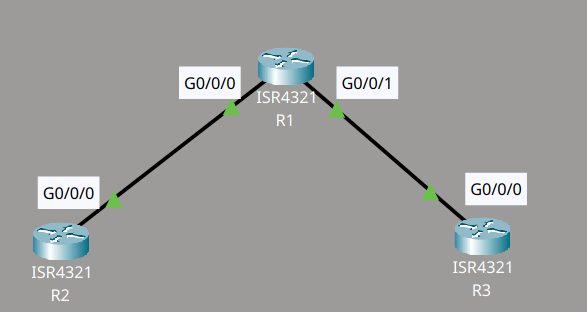

## Descripción del lab

Tras un corte de energía, la red ha dejado de funcionar. Para simular esta situación, se debe pulsar el botón "Power Cycle Devices" en Packet Tracer.

El objetivo es corregir los problemas y restaurar las configuraciones, de modo que los routers puedan hacer ping a todas las loopbacks.

Verificación: se utiliza la opción Power Cycle Devices de Packet Tracer para reiniciar los dispositivos. Es necesario comprobar que las configuraciones quedan restauradas y que las loopbacks responden al ping.

Lab creado por David Bombal.

## Router 1

En el Router 1, al ejecutar el comando `show version`, observé al final del resultado un registro de configuración (configuration register) con el valor `0x2142`. Este valor indica al router que, al iniciarse, debe ignorar por completo la startup-config y arrancar con una configuración nueva, como si fuera un equipo recién sacado de fábrica. Es decir, la running-config resultante no tiene relación alguna con la startup-config guardada.

```cmd
Configuration register is 0x2142
!
Router#sh run
Current configuration : 609 bytes
!
Router#sh start
Using 768 bytes
```

Es fundamental que, al hacer el reload del router, no se guarden los cambios. No se debe usar `write memory` ni `copy running-config startup-config`, ya que esto sobrescribiría la startup-config correcta con la configuración vacía que se encuentra en la VRAM en ese momento.

La solución consiste en corregir el registro de configuración al valor estándar:

```cmd
Router(config)#config-register 0x2102
```

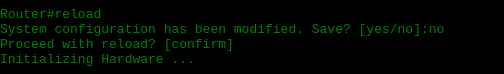


## Router 2

En este caso, el registro de configuración estaba fijado en `0x2100`, valor que hace que el router arranque en ROM Monitor Mode (rommon) en lugar de cargar el sistema operativo normalmente. La solución consistió en cambiar dicho registro al valor estándar `0x2102`, que corresponde al arranque normal de un router Cisco.

```cmd
rommon 2 > confreg 0x2102
rommon 3 > reset
```

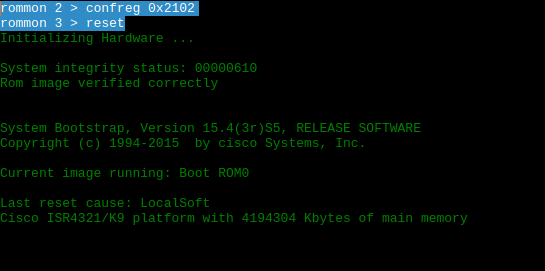

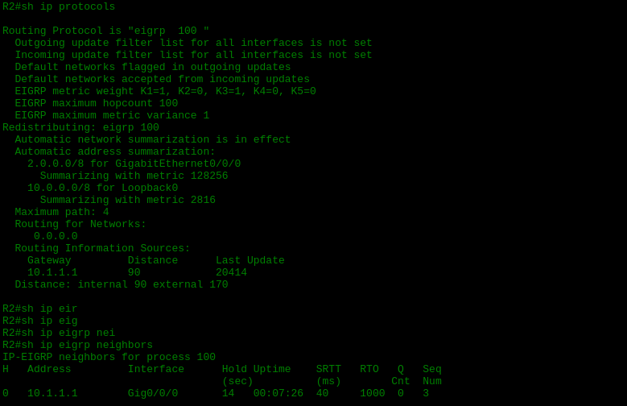

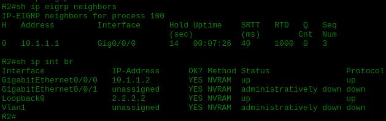

Adicionalmente, fue necesario eliminar una instrucción de arranque que apuntaba a un archivo inexistente:

```cmd
R3(config)#no boot system flash test.bin
```

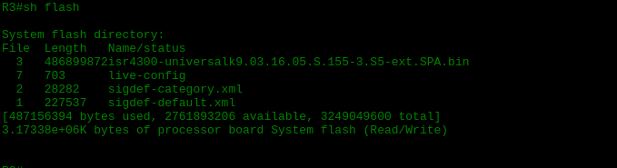

## Router 3

En el Router 3, el problema era que el equipo intentaba iniciar su configuración a partir de un archivo que no existía en la memoria flash. Para diagnosticarlo, revisé uno por uno los archivos disponibles en la flash y encontré uno llamado `live-config`, que contenía la interfaz loopback con su dirección IP correcta y el protocolo EIGRP configurado. La solución fue tomar ese archivo y cargarlo como running-config.

```cmd
R3#more flash:live-config
!
version 15.4
no service timestamps log datetime msec
no service timestamps debug datetime msec
no service password-encryption
!
hostname R3
!
!
boot system flash test.bin
!
ip cef
no ipv6 cef
!
spanning-tree mode pvst
!
interface Loopback0
ip address 3.3.3.3 255.255.255.255
!
interface GigabitEthernet0/0/0
ip address 10.1.2.2 255.255.255.0
duplex auto
speed auto
!
interface GigabitEthernet0/0/1
no ip address
duplex auto
speed auto
shutdown
!
interface Vlan1
no ip address
shutdown
!
router eigrp 100
network 0.0.0.0
auto-summary
!
ip classless
!
ip flow-export version 9
!
line con 0
!
line aux 0
!
line vty 0 4
login
!
end
```

```cmd
R3#copy flash run
Source filename []? live-config
Destination filename [running-config]?
```

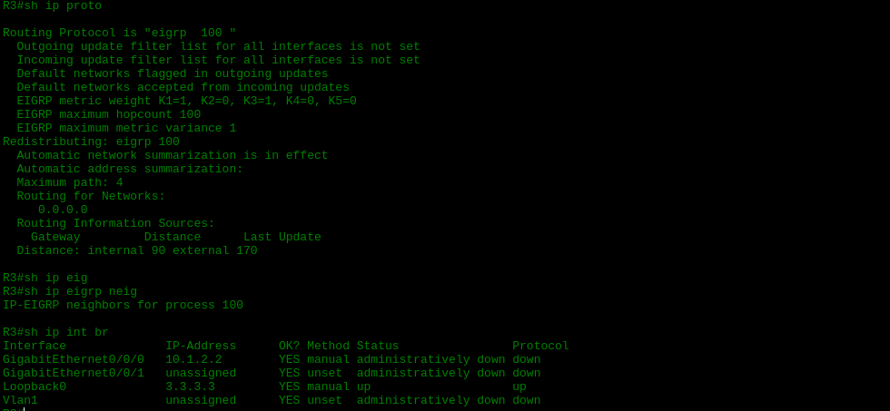

Tras aplicar la configuración, observé que las interfaces no estaban activadas, por lo que fue necesario levantarlas.

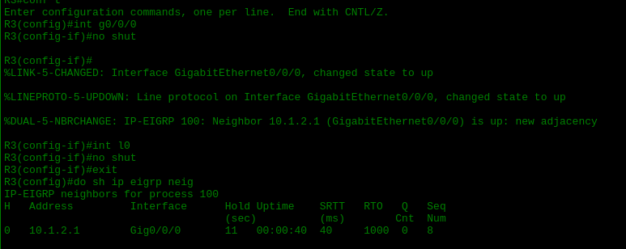

## Pruebas

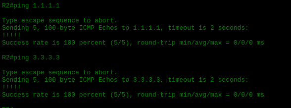

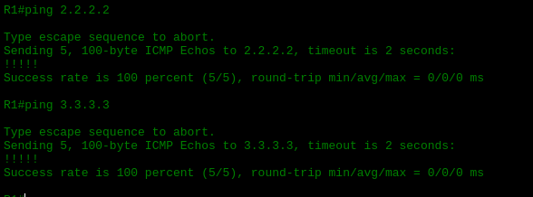

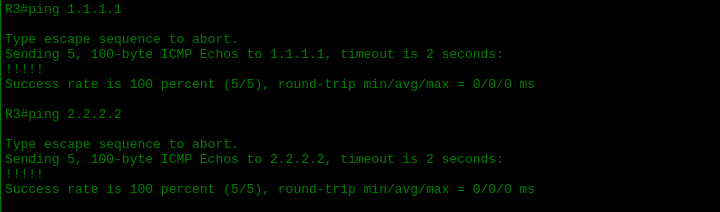
