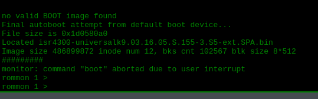
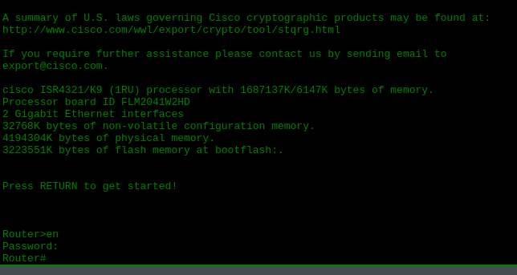
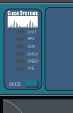
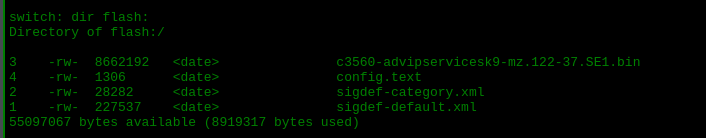
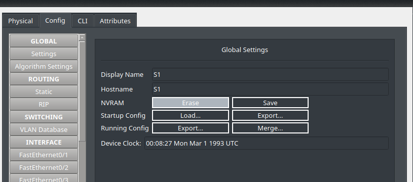
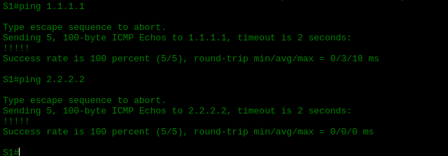
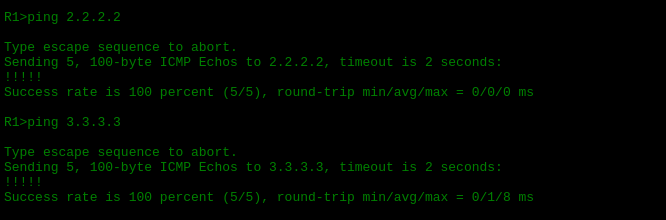
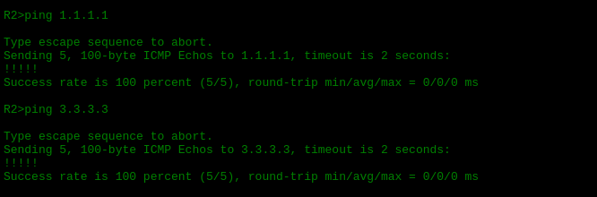

# Password Recovery

## Descripción del lab

Este lab consiste en recuperar el acceso a un router y a un switch de Cisco cuando se desconoce la contraseña de **enable**. Al no existir acceso al CLI mediante los métodos habituales, es necesario recurrir al acceso físico por **consola** y al modo **ROMMON** (ROM Monitor) para restablecer las credenciales. Cisco especifica que SSH y Telnet no son válidos para este procedimiento, ya que requiere acceso directo al dispositivo.

El lab se divide en dos partes: la recuperación de contraseña en un router (R1) y la recuperación de contraseña en un switch (S1). Al final se incluye una verificación de conectividad mediante pings.

---

## Router 1

### Acceso al modo ROMMON

Como no tengo acceso al CLI por desconocer la contraseña de enable, necesito el acceso por consola y reiniciar físicamente el router. Reinicio el dispositivo y, mientras arranca, pulso **Ctrl+C** para entrar en el modo ROMMON.



Dentro de ROMMON, cambio el valor del registro de configuración a `0x2142`. Este valor hexadecimal indica al router que, en el próximo arranque, debe ignorar la **startup-config** y cargar una configuración por defecto, sin contraseñas.

```cmd
rommon 1 > confreg 0x2142
rommon 2 > reset
```

### Configuración de la nueva contraseña

Tras reiniciar, el router arranca con una **running-config** distinta a la **startup-config** guardada. Esto ocurre porque, con el registro en `0x2142`, el dispositivo omite la configuración almacenada.


A continuación, copio la startup-config a la running-config para recuperar la configuración original del router, y establezco la nueva contraseña de enable, que en este lab es `Cisco`. Antes de guardar los cambios, devuelvo el registro de configuración a su valor normal, `0x2102`, para que el router vuelva a arrancar leyendo la startup-config en los siguientes reinicios.

```cmd
Router#copy startup-config running-config
Router(config)#enable secret cisco
Router(config)#config-register 0x2102
R1#copy running-config startup-config
R1#reload
```



Tras el reinicio, compruebo que ya puedo iniciar sesión con la nueva contraseña. Repito el mismo procedimiento en el Router 2.

---

## Switch 1

### Acceso al modo ROMMON

Para el switch, el procedimiento es distinto. Reinicio el dispositivo y, mientras arranca, pulso el botón físico **Mode** para entrar en el modo ROMMON.





Dentro de ROMMON, renombro el archivo de configuración en la memoria flash para que el switch no lo cargue al arrancar, y ejecuto el comando `boot` para continuar con el inicio.

```cmd
switch: rename flash:config.text flash:config.text.old
switch: boot
```

Al entrar al switch, compruebo que sigue solicitando la contraseña de enable, es decir, que no ha cambiado nada. Sin embargo, con el comando `show flash` confirmo que el archivo sí se ha renombrado correctamente.


### Borrado de la NVRAM

Para completar el acceso al switch, entro en el apartado de configuración del dispositivo y ejecuto el borrado (**erase**) de la **NVRAM**. Esta acción elimina la startup-config con la que el switch venía arrancando, por lo que el dispositivo se inicia como si fuera nuevo, sin configuración previa.



Después de este paso, recupero la configuración que había quedado guardada bajo el nombre `config.text.old`, y establezco la nueva contraseña de enable.

```cmd
S1#copy flash running-config
Source filename []? config.text.old
Destination filename [running-config]?
!
S1(config)#enable secret cisco
S1(config)#end
S1#copy run startup-config
```

---

## Verificación (Pings)

Por último, compruebo la conectividad de la red mediante pings, para confirmar que la configuración se ha restaurado correctamente en ambos dispositivos.




