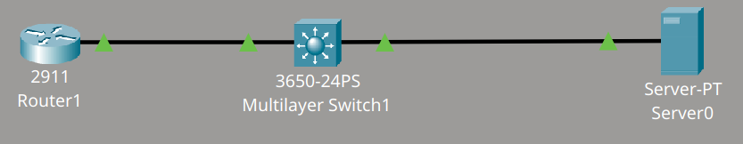
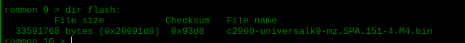
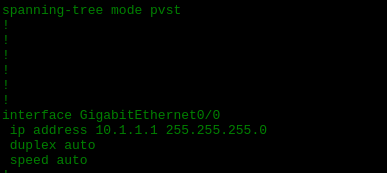

# Restauración del IOS del router

## Descripción del laboratorio

Un becario ha borrado el sistema operativo del router. El objetivo del laboratorio consiste en restaurar el IOS del router desde el servidor TFTP y comprobar que el router arranca correctamente.

Material proporcionado por **David Bombal**.

**Tareas:**

1. Restaurar el sistema operativo del router desde el servidor TFTP.
   - Archivo a utilizar: `c2900-universalk9-mz.SPA.151-4.M4.bin`
2. Verificación:
   - Comprobar que el router arranca correctamente.
   - Comprobar que el router puede hacer ping al servidor TFTP (10.1.1.100) y al switch (10.1.1.2).

## Topología



## Desarrollo del laboratorio

Al principio, configuro la dirección IP del router junto con su default gateway. En esta configuración, el default gateway coincide con la misma IP address que he asignado al router. También configuro la máscara de red, indico la dirección del servidor TFTP y el archivo que deseo descargar. Con estos datos, utilizo el comando `tftpdnld` para descargar el archivo.

```cmd
rommon 2 > IP_SUBNET_MASK=255.255.255.0
rommon 3 > IP_ADDRESS=10.1.1.1
rommon 4 > TFTP_SERVER=10.1.1.100
rommon 5 > TFTP_FILE=c2900-universalk9-mz.SPA.151-4.M4.bin
rommon 7 > DEFAULT_GATEWAY=10.1.1.1
rommon 8 > tftpdnld
```

Al ejecutar el comando `dir flash:`, compruebo que el archivo ya se encuentra en el sistema. A continuación, arranco el router con este archivo mediante un comando sencillo.



```cmd
rommon 10 > boot flash:c2900-universalk9-mz.SPA.151-4.M4.bin
```

Al acceder al router, observo que la running config y la startup config no coinciden. Por este motivo, configuro el config register en modo normal (0x2102) y reinicio el router. Es importante reiniciar sin sobrescribir la startup config con la running config, ya que de lo contrario se perdería la configuración original.

```cmd
Router(config)#config-register 0x2102
Router(config)#end
Router#reload
```

Una vez reiniciado el router, compruebo que toda la configuración se mantiene correcta.


