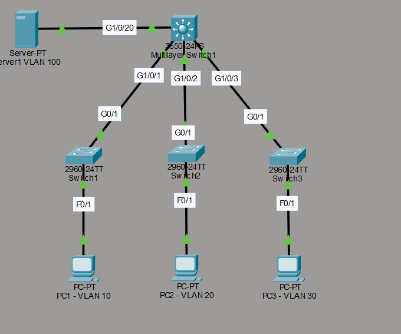
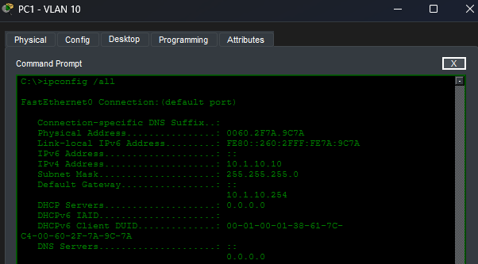
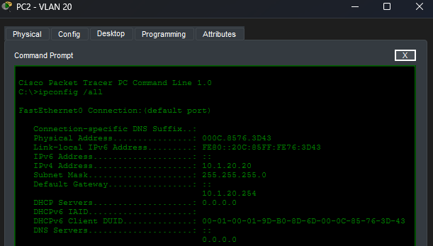
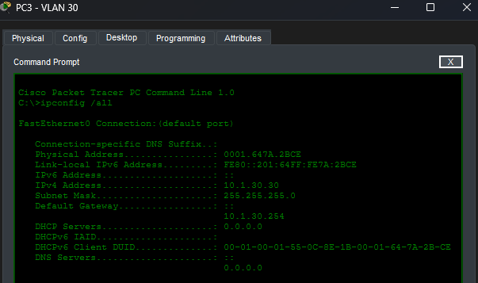
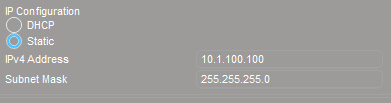
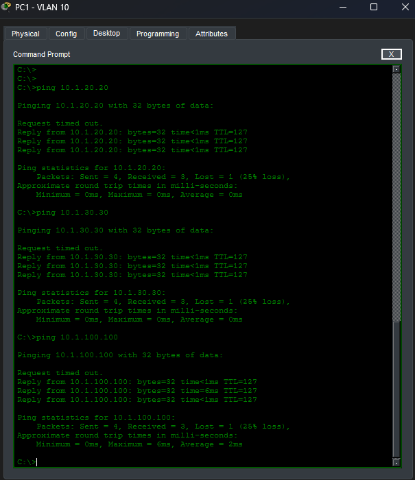
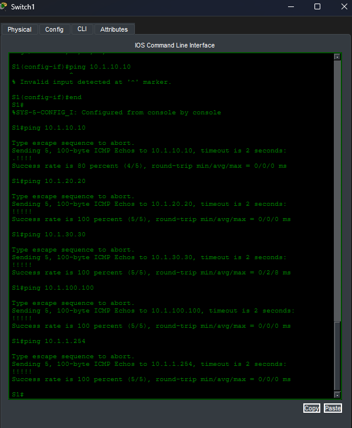

# Configuración básica de VLANs

Material proporcionado por David Bombal.

## Topología



## Objetivo del laboratorio

El propósito de este laboratorio es configurar una red con varias VLANs y enrutamiento entre ellas. Para lograrlo, se deben cumplir los siguientes puntos:

1. El switch modelo 3650 actúa como switch de capa 3. Debe tener las siguientes direcciones IP y encargarse del enrutamiento entre VLANs:
   - VLAN 1: 10.1.1.254/24
   - VLAN 10: 10.1.10.254/24
   - VLAN 20: 10.1.20.254/24
   - VLAN 30: 10.1.30.254/24
   - VLAN 100: 10.1.100.254/24

2. Los switches de la capa de acceso solo necesitan una dirección IP de gestión, ubicada en la VLAN 1:
   - Switch 1: 10.1.1.1/24
   - Switch 2: 10.1.1.2/24
   - Switch 3: 10.1.1.3/24

3. Los puertos de acceso deben configurarse de la siguiente manera:
   - PC1 en la VLAN 10, con dirección 10.1.10.10/24
   - PC2 en la VLAN 20, con dirección 10.1.20.20/24
   - PC3 en la VLAN 30, con dirección 10.1.30.30/24
   - Server1 en la VLAN 100, con dirección 10.1.100.100/24

4. Los puertos que conectan los switches entre sí deben configurarse como enlaces troncales (trunk).

5. Los equipos (PCs) deben poder comunicarse entre ellos y con el servidor mediante ping.

6. Los switches deben poder comunicarse mediante ping con los equipos y con el servidor.

## Paso 1: Configuración de los puertos de acceso

En primer lugar, se configuran los puertos de acceso de cada switch, asignando cada uno a su VLAN correspondiente.

```cmd
S1(config)#int f 0/1
S1(config-if)#sw mode access
S1(config-if)#sw access vlan 10
!
S2(config)#int f 0/1
S2(config-if)#sw mode access
S2(config-if)#sw access vlan 20
!
S3(config)#int f 0/1
S3(config-if)#sw mode access
S3(config-if)#sw access vlan 30
```

## Paso 2: Configuración de los puertos troncales

En este laboratorio se ha optado por crear todas las VLANs manualmente en cada switch. Por ejemplo, en el switch 1 solo existía la VLAN 10 y la VLAN nativa (VLAN 1), por lo que fue necesario crear también la VLAN 20 y la VLAN 30. Este mismo procedimiento se repitió en el resto de los switches.

Cabe mencionar que existe una alternativa más eficiente a este método manual: el uso de un servidor VTP (VLAN Trunking Protocol). Con esta opción, un switch actúa como servidor VTP y los demás como clientes VTP, de modo que la base de datos de VLANs se actualiza automáticamente en todos los equipos, sin necesidad de configurarlas una por una. David Bombal explica este procedimiento con más detalle en el vídeo del curso.

```cmd
S1(config-vlan)#int g0/1
S1(config-if)#sw mode trunk
S1(config-if)#no shut
S1(config-if)#switchport trunk allowed vlan 10,20,30,100
!
S2(config-vlan)#int g0/1
S2(config-if)#sw mode trunk
S2(config-if)#no shut
S2(config-if)#switchport trunk allowed vlan 10,20,30,100
!
S3(config-vlan)#int g0/1
S3(config-if)#sw mode trunk
S3(config-if)#no shut
S3(config-if)#switchport trunk allowed vlan 10,20,30,100
```

```cmd
Core(config)#interface g1/0/1
Core(config-if)#sw mode trunk
Core(config-if)#switchport trunk allowed vlan 10,20,30,100
!
Core(config-if)#interface g1/0/2
Core(config-if)#sw mode trunk
Core(config-if)#switchport trunk allowed vlan 10,20,30,100
!
Core(config-if)#interface g1/0/3
Core(config-if)#sw mode trunk
Core(config-if)#switchport trunk allowed vlan 10,20,30,100
```

## Paso 3: Configuración de las interfaces virtuales (SVI) en el switch Core

```cmd
Core(config)#int vlan 1
Core(config-if)#ip add 10.1.1.254 255.255.255.0
Core(config-if)#no shut
!
Core(config-if)#int vlan 10
Core(config-if)#ip add 10.1.10.254 255.255.255.0
Core(config-if)#no shut
!
Core(config-if)#int vlan 20
Core(config-if)#ip add 10.1.20.254 255.255.255.0
Core(config-if)#no shut
!
Core(config-if)#int vlan 30
Core(config-if)#ip add 10.1.30.254 255.255.255.0
Core(config-if)#no shut
!
Core(config-if)#int vlan 100
Core(config-if)#ip add 10.1.100.254 255.255.255.0
Core(config-if)#no shut
!
Core(config)#ip routing
```

## Paso 4: Configuración de las interfaces virtuales (SVI) en la capa de acceso

```cmd
S1(config)#int vlan 1
S1(config-if)#ip add 10.1.1.1 255.255.255.0
S1(config-if)#no shut
!
S2(config)#int vlan 1
S2(config-if)#ip add 10.1.1.2 255.255.255.0
S2(config-if)#no shut
!
S3(config)#int vlan 1
S3(config-if)#ip add 10.1.1.3 255.255.255.0
S3(config-if)#no shut
```

## Paso 5: Configuración de los equipos finales

### PCs





### Server1 (VLAN 100)



## Paso 6: Pruebas de conectividad entre equipos

Una vez completada la configuración, se realizaron pruebas de ping entre los equipos finales para verificar que la comunicación entre VLANs funciona correctamente.



## Paso 7: Pruebas de conectividad desde los switches

Durante esta fase se descubrió que, para que los switches de acceso pudieran hacer ping hacia otros nodos de la red, era necesario configurarles una puerta de enlace predeterminada (default gateway).

Además, se identificó un segundo problema relacionado con la forma en que se habían configurado los enlaces troncales: por costumbre, se excluía la VLAN nativa (VLAN 1) de la lista de VLANs permitidas en dichos enlaces. Esto impedía que los switches pudieran hacer ping correctamente, ya que sus paquetes se preparaban pero no podían salir por el enlace troncal, al no tener permiso para transmitir por la VLAN 1, que es justamente la VLAN de gestión utilizada para llegar hasta la puerta de enlace.

```cmd
S1(config)#ip default-gateway 10.1.1.254
S2(config)#ip default-gateway 10.1.1.254
S3(config)#ip default-gateway 10.1.1.254
!
S1(config-if)#sw trunk allowed vlan add 1
S2(config-if)#sw trunk allowed vlan add 1
S3(config-if)#sw trunk allowed vlan add 1
!
Core(config)#int range g1/0/1-3
Core(config)#sw trunk allowed vlan add 1
Core(config)#int g1/0/20
Core(config-if)#sw trunk allowed vlan add 1
```

Tras aplicar estos cambios, los switches pudieron comunicarse correctamente con los equipos y el servidor.


